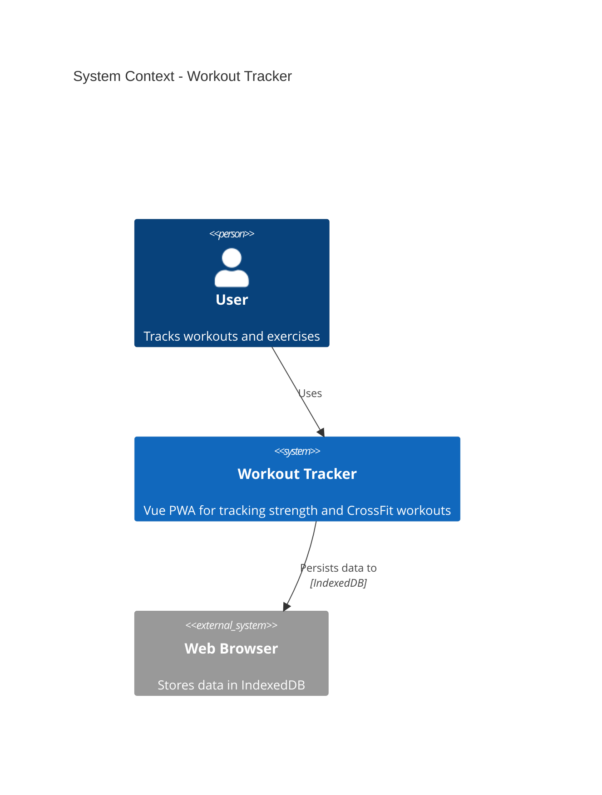
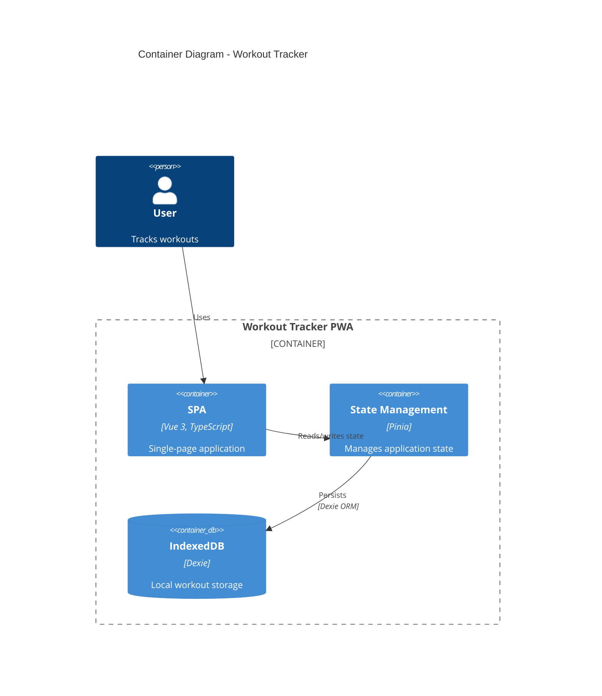
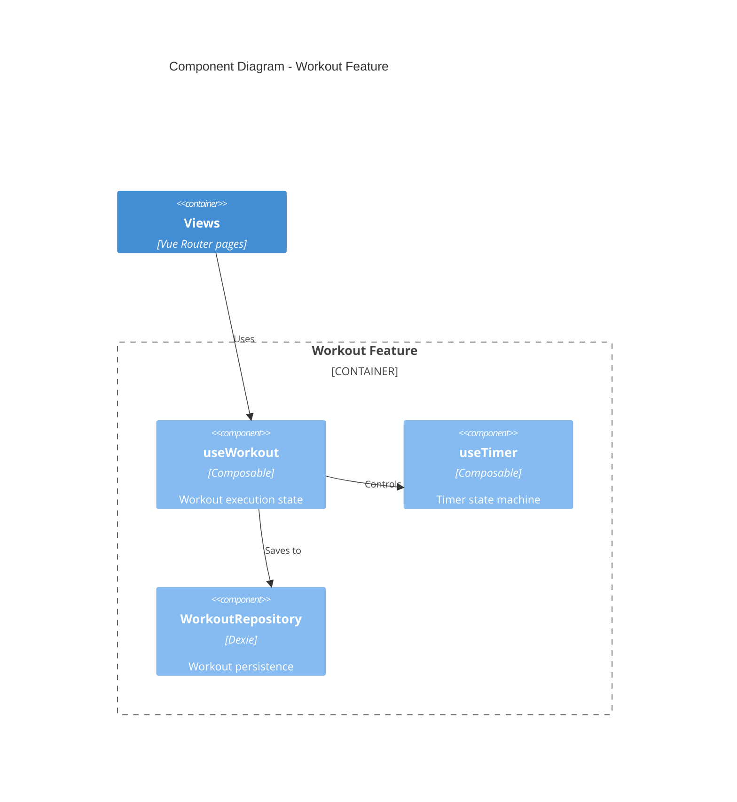
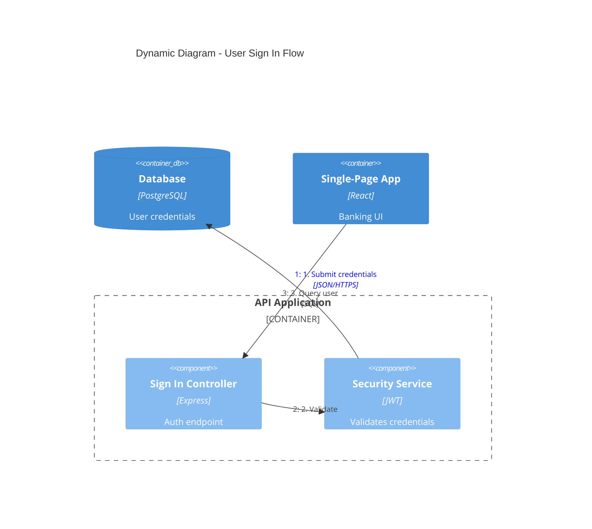
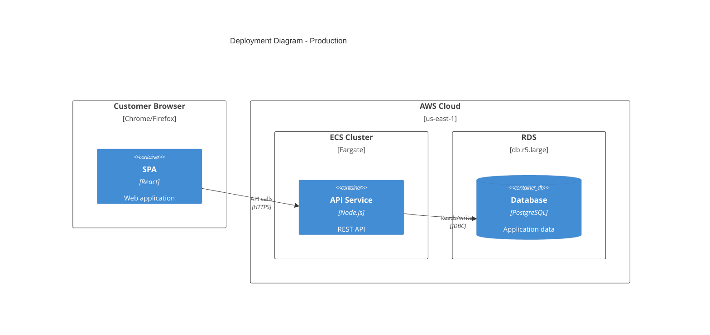
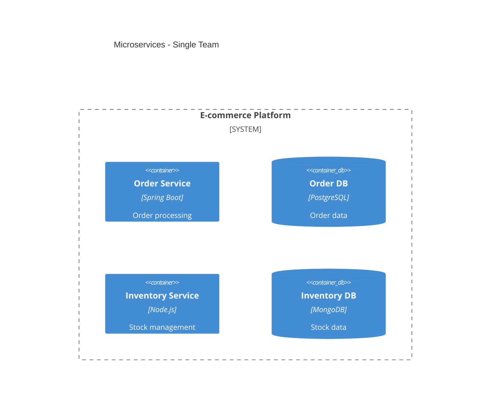
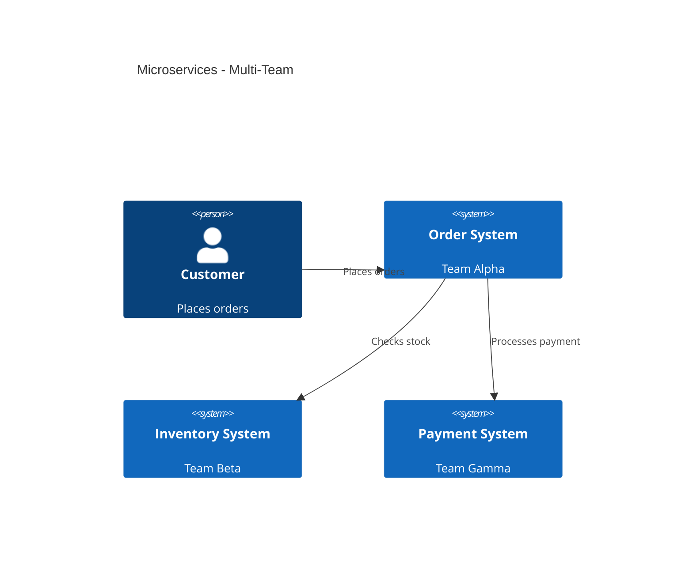
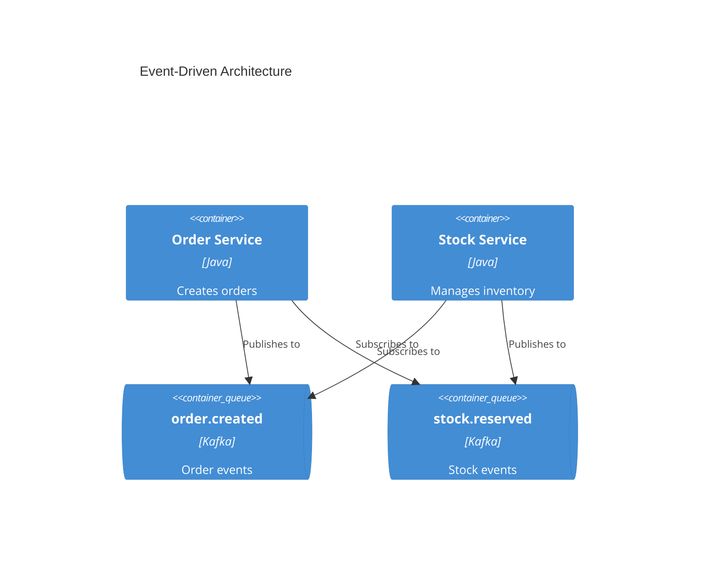

# C4 Architecture Documentation

Generate software architecture documentation using C4 model diagrams in Mermaid syntax.

## Workflow

1. **Understand scope** - Determine which C4 level(s) are needed based on audience
2. **Analyze codebase** - Explore the system to identify components, containers, and relationships
3. **Generate diagrams** - Create Mermaid C4 diagrams at appropriate abstraction levels
4. **Document** - Write diagrams to markdown files with explanatory context

## C4 Diagram Levels

Select the appropriate level based on the documentation need:

| Level | Diagram Type | Audience | Shows | When to Create |
|-------|-------------|----------|-------|----------------|
| 1 | **C4Context** | Everyone | System + external actors | Always (required) |
| 2 | **C4Container** | Technical | Apps, databases, services | Always (required) |
| 3 | **C4Component** | Developers | Internal components | Only if adds value |
| 4 | **C4Deployment** | DevOps | Infrastructure nodes | For production systems |
| - | **C4Dynamic** | Technical | Request flows (numbered) | For complex workflows |

**Key Insight:** "Context + Container diagrams are sufficient for most software development teams." Only create Component/Code diagrams when they genuinely add value.

## Working with Specific C4 Levels

When creating architecture documentation, you may need to focus on a single C4 level. Use the level-specific reference guides for detailed guidance:

| Level | Reference Guide | Focus |
|-------|----------------|-------|
| Context | [c4-level-context.md](references/c4-level-context.md) | System boundary, external actors, user personas |
| Container | [c4-level-container.md](references/c4-level-container.md) | High-level technology choices, deployable units |
| Component | [c4-level-component.md](references/c4-level-component.md) | Internal components, interfaces, logical groupings |
| Code | [c4-level-code.md](references/c4-level-code.md) | Classes, interfaces, database schemas (rarely needed) |

### Level Selection Decision Tree

```
Start
 └─> Who is the audience?
      ├─> Non-technical stakeholders → Context diagram only
      ├─> Product/Business → Context + Container diagrams
      ├─> Technical leads/Architects → Context + Container + key Component diagrams
      └─> Development team → All levels as needed

For each level, ask: "Does this diagram answer questions that the previous level cannot?"
 └─> NO → Stop at previous level
 └─> YES → Create this level, then repeat question for next level
```

### When to Stop at Each Level

- **Stop at Context** when:
  - Audience is non-technical (executives, business stakeholders)
  - You only need to show system boundaries and external dependencies
  - System is simple with few containers (< 3)

- **Stop at Container** when:
  - System architecture is straightforward
  - Container responsibilities are clear from their names
  - No particularly complex containers requiring internal breakdown
  - **This is the recommended stopping point for 80% of systems**

- **Stop at Component** when:
  - Internal structure is well-understood by the team
  - Component boundaries are clear from code organization
  - No need for sequence diagrams or detailed interaction flows

- **Use Code level** only when:
  - Documenting a particularly complex algorithm or data structure
  - Onboarding new developers to legacy code
  - Showing database schema relationships
  - Creating sequence diagrams for critical flows

### Cross-Level Consistency Checks

When creating multiple C4 levels, ensure consistency across diagrams:

1. **Naming consistency**: Same element at different levels must use identical names
   - Context: `System(orderSystem, "Order System", "...")`
   - Container: `Container_Boundary(orderSystem, "Order System") { ... }`

2. **Relationship preservation**: Relationships shown at higher levels must be reflected in lower levels
   - If Context shows `Order System → Inventory System`
   - Container must show which specific containers make that connection

3. **Technology cascade**: Technology choices at Container level apply to Components within
   - Container: `Container(api, "API", "FastAPI", "...")`
   - Components within must use FastAPI-compatible technologies

4. **Scope boundaries**: Elements shown at one level must "zoom into" their children at next level
   - Container diagram shows `Container(webApp, "Web App", "React", "...")`
   - Component diagram shows internal React components within that container

### Instructing matd-architect for Level-Specific Work

When delegating to `matd-architect` for a specific C4 level:

```markdown
# For Context level
"Create C4 Context diagram focusing ONLY on system boundary and external actors.
 Use arch-c4-architecture skill with references/c4-level-context.md guidance.
 Show: user personas, external systems, system boundaries.
 Exclude: internal structure, technology choices, deployment details."

# For Container level
"Create C4 Container diagram focusing ONLY on high-level containers.
 Use arch-c4-architecture skill with references/c4-level-container.md guidance.
 Show: deployable units, databases, technology stack, inter-container communication.
 Exclude: internal components, code-level details, infrastructure nodes."

# For Component level
"Create C4 Component diagram focusing ONLY on internal components of [container name].
 Use arch-c4-architecture skill with references/c4-level-component.md guidance.
 Show: logical groupings, component interfaces, internal dependencies.
 Exclude: class details, deployment info, external systems."

# For Code level (rarely)
"Create C4 Code diagram ONLY IF complexity warrants detailed documentation.
 Use arch-c4-architecture skill with references/c4-level-code.md guidance.
 Show: class hierarchies, database schemas, sequence diagrams for key flows.
 Justify: [reason this level of detail is necessary]."
```

## Quick Start Examples

### System Context (Level 1)


### Container Diagram (Level 2)


### Component Diagram (Level 3)


### Dynamic Diagram (Request Flow)


### Deployment Diagram


## Element Syntax

### People and Systems
```
Person(alias, "Label", "Description")
Person_Ext(alias, "Label", "Description")       # External person
System(alias, "Label", "Description")
System_Ext(alias, "Label", "Description")       # External system
SystemDb(alias, "Label", "Description")         # Database system
SystemQueue(alias, "Label", "Description")      # Queue system
```

### Containers
```
Container(alias, "Label", "Technology", "Description")
Container_Ext(alias, "Label", "Technology", "Description")
ContainerDb(alias, "Label", "Technology", "Description")
ContainerQueue(alias, "Label", "Technology", "Description")
```

### Components
```
Component(alias, "Label", "Technology", "Description")
Component_Ext(alias, "Label", "Technology", "Description")
ComponentDb(alias, "Label", "Technology", "Description")
```

### Boundaries
```
Enterprise_Boundary(alias, "Label") { ... }
System_Boundary(alias, "Label") { ... }
Container_Boundary(alias, "Label") { ... }
Boundary(alias, "Label", "type") { ... }
```

### Relationships
```
Rel(from, to, "Label")
Rel(from, to, "Label", "Technology")
BiRel(from, to, "Label")                        # Bidirectional
Rel_U(from, to, "Label")                        # Upward
Rel_D(from, to, "Label")                        # Downward
Rel_L(from, to, "Label")                        # Leftward
Rel_R(from, to, "Label")                        # Rightward
```

### Deployment Nodes
```
Deployment_Node(alias, "Label", "Type", "Description") { ... }
Node(alias, "Label", "Type", "Description") { ... }  # Shorthand
```

## Styling and Layout

### Layout Configuration
```
UpdateLayoutConfig($c4ShapeInRow="3", $c4BoundaryInRow="1")
```
- `$c4ShapeInRow` - Number of shapes per row (default: 4)
- `$c4BoundaryInRow` - Number of boundaries per row (default: 2)

### Element Styling
```
UpdateElementStyle(alias, $fontColor="red", $bgColor="grey", $borderColor="red")
```

### Relationship Styling
```
UpdateRelStyle(from, to, $textColor="blue", $lineColor="blue", $offsetX="5", $offsetY="-10")
```
Use `$offsetX` and `$offsetY` to fix overlapping relationship labels.

## Best Practices

### Essential Rules

1. **Every element must have**: Name, Type, Technology (where applicable), and Description
2. **Use unidirectional arrows only** - Bidirectional arrows create ambiguity
3. **Label arrows with action verbs** - "Sends email using", "Reads from", not just "uses"
4. **Include technology labels** - "JSON/HTTPS", "JDBC", "gRPC"
5. **Stay under 20 elements per diagram** - Split complex systems into multiple diagrams

### Clarity Guidelines

1. **Start at Level 1** - Context diagrams help frame the system scope
2. **One diagram per file** - Keep diagrams focused on a single abstraction level
3. **Meaningful aliases** - Use descriptive aliases (e.g., `orderService` not `s1`)
4. **Concise descriptions** - Keep descriptions under 50 characters when possible
5. **Always include a title** - "System Context diagram for [System Name]"

### What to Avoid

See [references/common-mistakes.md](references/common-mistakes.md) for detailed anti-patterns:
- Confusing containers (deployable) vs components (non-deployable)
- Modeling shared libraries as containers
- Showing message brokers as single containers instead of individual topics
- Adding undefined abstraction levels like "subcomponents"
- Removing type labels to "simplify" diagrams

## Microservices Guidelines

### Single Team Ownership
Model each microservice as a **container** (or container group):


### Multi-Team Ownership
Promote microservices to **software systems** when owned by separate teams:


### Event-Driven Architecture
Show individual topics/queues as containers, NOT a single "Kafka" box:


## Output Location

Write architecture documentation to `docs/architecture/` with naming convention:
- `c4-context.md` - System context diagram
- `c4-containers.md` - Container diagram
- `c4-components-{feature}.md` - Component diagrams per feature
- `c4-deployment.md` - Deployment diagram
- `c4-dynamic-{flow}.md` - Dynamic diagrams for specific flows

## Audience-Appropriate Detail

| Audience | Recommended Diagrams |
|----------|---------------------|
| Executives | System Context only |
| Product Managers | Context + Container |
| Architects | Context + Container + key Components |
| Developers | All levels as needed |
| DevOps | Container + Deployment |

## References

- [references/c4-syntax.md](references/c4-syntax.md) - Complete Mermaid C4 syntax
- [references/common-mistakes.md](references/common-mistakes.md) - Anti-patterns to avoid
- [references/advanced-patterns.md](references/advanced-patterns.md) - Microservices, event-driven, deployment
- [references/c4-level-context.md](references/c4-level-context.md) - Context level guide (system boundary, external actors)
- [references/c4-level-container.md](references/c4-level-container.md) - Container level guide (deployable units, technology)
- [references/c4-level-component.md](references/c4-level-component.md) - Component level guide (internal components, interfaces)
- [references/c4-level-code.md](references/c4-level-code.md) - Code level guide (classes, schemas, sequences)
- [references/c4-best-practices.md](references/c4-best-practices.md) - Industry best practices (Simon Brown, progressive disclosure)
