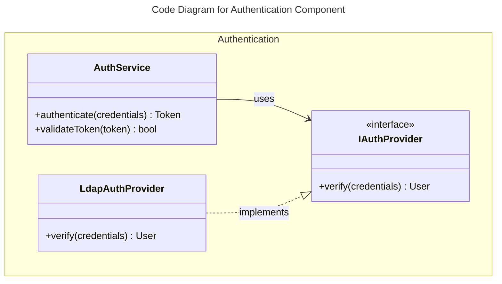
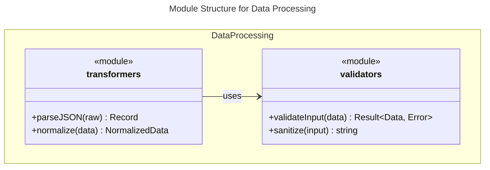
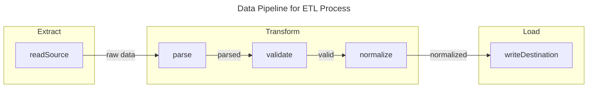

# C4 Level: Code

## Purpose

Code level is the foundation of C4 architecture, documenting individual code elements at the most granular level with complete accuracy. This level serves as the basis for all higher-level C4 diagrams.

## What to Include (Scope)

**Document all code elements:**
- Functions and methods (with complete signatures)
- Classes and interfaces
- Modules and packages
- Type definitions and schemas
- Public and private APIs
- Code structure and organization

**Capture details:**
- Function signatures with parameters, types, return types
- Class hierarchies and inheritance
- Interface implementations
- Dependencies (internal and external)
- Code relationships and call graphs
- Design patterns in use

**Support all paradigms:**
- Object-Oriented (classes, interfaces, inheritance)
- Functional Programming (pure functions, modules, pipelines)
- Procedural (functions, structs, modules)
- Mixed paradigms

## What to Exclude (Boundaries)

**Not at this level:**
- Business context (Context level)
- Deployment details (Container level)
- Component groupings (Component level)

**Avoid documenting:**
- Implementation details (focus on structure)
- Line-by-line code walkthrough
- Every single private helper function
- Temporary or test-only code

## Key Elements to Show

### In Code Diagrams

**Choose diagram type based on paradigm:**

**Object-Oriented Code:** Use `classDiagram`


**Functional/Module Code:** Use `classDiagram` with modules


**Data Flow/Pipeline:** Use `flowchart`


### In Documentation

**Per Code Directory:**
- Name and description
- Location (file path)
- Primary language(s)
- Purpose

**Per Function/Method:**
- Complete signature: `functionName(param1: Type, param2: Type): ReturnType`
- Description of what it does
- Location (file:line)
- Dependencies

**Per Class/Module:**
- Name and description
- Location (file path)
- Methods/exports
- Dependencies

**Dependencies:**
- Internal dependencies (other code in project)
- External dependencies (libraries, frameworks, services)

## When to Use This Level

- Starting C4 documentation (foundation)
- Documenting code structure
- Understanding code organization
- Before Component-level synthesis
- When analyzing codebases
- For complex components needing detail

**Note:** Most teams don't need code diagrams for every component. Create them only when needed for complex components.

## Examples

### Good Code Documentation (OOP)
```markdown
# C4 Code Level: Authentication Services

## Overview
- **Name**: Authentication Services
- **Location**: /src/services/auth
- **Language**: TypeScript
- **Purpose**: Handles user authentication and token validation

## Code Elements

### Classes

**AuthService**
- Description: Main authentication service handling login/logout
- Location: src/services/auth/AuthService.ts
- Methods:
  - `authenticate(credentials: Credentials): Promise<Token>`
  - `validateToken(token: string): Promise<boolean>`
  - `revokeToken(token: string): Promise<void>`
- Dependencies: IAuthProvider, TokenManager

**LdapAuthProvider**
- Description: LDAP authentication provider implementation
- Location: src/services/auth/providers/LdapAuthProvider.ts
- Implements: IAuthProvider
- Methods:
  - `verify(credentials: Credentials): Promise<User>`

## Dependencies

### Internal
- TokenManager (src/services/auth/TokenManager.ts)
- IAuthProvider interface

### External
- ldapjs v2.3.3 (LDAP client)
- jsonwebtoken v9.0.0 (JWT handling)
```

### Good Code Documentation (Functional)
```markdown
# C4 Code Level: Data Validators

## Overview
- **Name**: Data Validators
- **Location**: /src/utils/validators
- **Language**: JavaScript (ES6)
- **Purpose**: Pure functions for data validation and sanitization

## Code Elements

### Functions

**validateInput(data: unknown): Result<Data, Error>**
- Description: Validates input data against schema
- Location: src/utils/validators/input.js:15
- Dependencies: ajv schema validator

**sanitize(input: string): string**
- Description: Sanitizes string input removing dangerous characters
- Location: src/utils/validators/sanitize.js:8
- Dependencies: DOMPurify

**validateSchema(schema: JSONSchema, data: unknown): boolean**
- Description: Validates data against JSON schema
- Location: src/utils/validators/schema.js:22
- Dependencies: ajv

## Dependencies

### Internal
- None (pure utility functions)

### External
- ajv v8.12.0 (JSON schema validation)
- DOMPurify v3.0.0 (HTML sanitization)
```

## Common Mistakes

**Missing function signatures:**
- ❌ Just listing function names
- ❌ No parameter types or return types
- ✅ Complete signatures with all details
- ✅ `functionName(param: Type): ReturnType`

**Incomplete dependencies:**
- ❌ Only showing imports
- ❌ Missing internal dependencies
- ✅ All internal and external dependencies
- ✅ Library versions specified

**Poor organization:**
- ❌ Flat list of every function
- ❌ No logical grouping
- ✅ Grouped by class/module/file
- ✅ Clear structure

**Missing locations:**
- ❌ No file paths
- ❌ No line numbers
- ✅ Link to actual source code
- ✅ file:line references

**Wrong diagram type:**
- ❌ classDiagram for functional code pipelines
- ❌ flowchart for class hierarchies
- ✅ Choose based on programming paradigm
- ✅ Match diagram to code structure

**Over-documenting:**
- ❌ Every helper function
- ❌ Implementation details
- ✅ Significant code elements only
- ✅ Focus on structure, not implementation

## Tips for Effective Code Documentation

**Complete signatures:**
- Include all parameters with types
- Include return types
- Include type constraints
- Document exceptions/errors

**Link to source:**
- File paths for all code elements
- Line numbers when helpful
- Maintain accurate references
- Update when code moves

**Map dependencies thoroughly:**
- Internal code dependencies
- External library dependencies
- Include versions for external deps
- Show dependency relationships

**Choose right diagram:**
- OOP → classDiagram
- Modules/Exports → classDiagram with <<module>>
- Data pipelines → flowchart
- Function dependencies → flowchart
- Match paradigm to diagram type

**Support all paradigms:**
- Document OOP with class hierarchies
- Document FP with pure functions and modules
- Document procedural with function graphs
- Use appropriate visualization for each

**Be systematic:**
- Start from deepest directories
- Document every significant element
- Maintain consistent format
- Create comprehensive foundation

**Think structure, not implementation:**
- What code elements exist?
- How do they relate?
- What are their interfaces?
- Not: How do they work internally?

## Workflow Position

- **Input**: Source code directories and files
- **First step**: Code is the foundation of C4
- **Before**: C4-Component level
- **Output**: c4-code-<name>.md for each directory
- **Purpose**: Comprehensive code structure documentation
- **Enables**: Component, Container, and Context synthesis

## Diagram Type Decision Matrix

| Code Style | Structure to Show | Diagram Type | Example |
|------------|------------------|--------------|---------|
| Classes, interfaces | Inheritance, composition | `classDiagram` | OOP codebases |
| Modules with exports | Module dependencies | `classDiagram` with <<module>> | Node.js, Python modules |
| Pure functions | Data transformations | `flowchart` (pipeline) | ETL, data processing |
| Function calls | Call graph | `flowchart` (graph) | Functional composition |
| Structs + functions | Data + operations | `classDiagram` | Go, Rust, C |
| Mixed | Depends on primary pattern | Multiple diagrams | Hybrid codebases |
