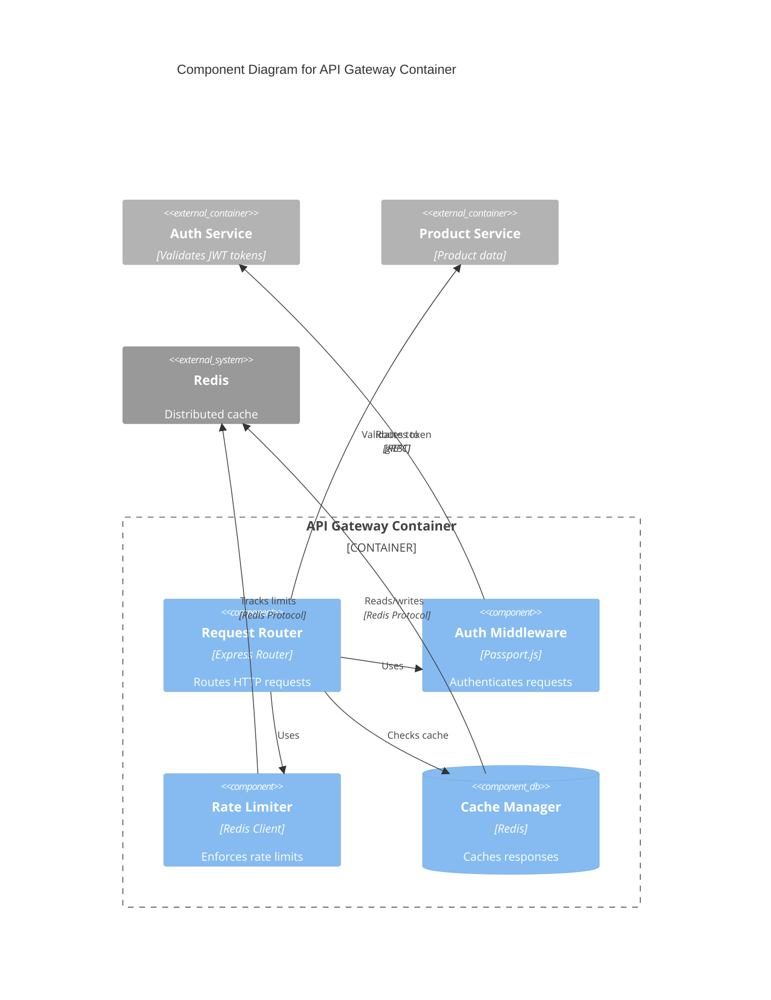

# C4 Level: Component

## Purpose

Component level shows logical groupings of code that work together to provide cohesive functionality, bridging code-level detail with container-level deployment concerns.

## What to Include (Scope)

**Focus on logical components:**
- Components within a single container
- Component responsibilities
- Component interfaces (APIs, contracts)
- Software features provided
- Component relationships
- Dependencies between components

**Documentation elements:**
- Component names and descriptions
- Software features/capabilities
- Links to contained code elements
- Interface definitions
- Technology stack (if different from container)
- Dependency mappings
- Component diagrams

## What to Exclude (Boundaries)

**Not at this level:**
- Deployment concerns (Container level)
- Individual code details (Code level)
- System context (Context level)
- How components are deployed together

**Avoid:**
- Function implementations
- Line-by-line code
- Infrastructure details
- Deployment configurations

## Key Elements to Show

### In Component Diagrams

Use Mermaid C4Component syntax:
- `Component()` for logical components
- `ComponentDb()` for data access components
- `Container_Boundary()` to show components within one container
- `Container_Ext()` for external containers
- `System_Ext()` for external systems
- `Rel()` for component interactions

**Important:** Component diagrams show components **within a single container** (zoom into one container).

### In Documentation

**Per Component:**
- Name and description
- Type (Service, Library, Module, etc.)
- Technology (if different from container)
- Purpose and responsibilities
- Software features provided
- Code elements contained (links to c4-code-*.md)
- Interfaces exposed
- Dependencies (components and external systems)

**Interfaces:**
- Protocol (REST, GraphQL, gRPC, Events, etc.)
- Operations/methods
- Request/response schemas
- Contracts and expectations

**Features:**
- What functionality this component provides
- Why this component exists
- What problems it solves

## When to Use This Level

- Defining component boundaries
- Organizing code into logical groupings
- Documenting component interfaces
- Understanding component relationships
- After Code-level documentation
- Before Container-level documentation
- When components map to domain/technical/organizational boundaries

## Examples

### Good Component Diagram


### Good Component Documentation
```markdown
# C4 Component Level: Request Router

## Overview
- **Name**: Request Router
- **Type**: Application Component
- **Technology**: Express.js Router, TypeScript
- **Description**: Routes incoming HTTP requests to appropriate microservices

## Purpose
Analyzes incoming HTTP requests and routes them to the correct backend service based on URL path, HTTP method, and request headers. Handles request transformation and response aggregation.

## Software Features
- Path-based routing to microservices
- HTTP method routing (GET, POST, PUT, DELETE)
- Request transformation (header manipulation, payload transformation)
- Response aggregation from multiple services
- Health check endpoints

## Code Elements
- [c4-code-router-core.md](./c4-code-router-core.md) - Core routing logic
- [c4-code-router-config.md](./c4-code-router-config.md) - Route configuration
- [c4-code-router-handlers.md](./c4-code-router-handlers.md) - Request handlers

## Interfaces

### HTTP Routing Interface
- **Protocol**: REST/HTTP
- **Operations**:
  - `route(request): RouteResult` - Routes request to appropriate service
  - `transform(request): TransformedRequest` - Transforms request format
  - `aggregate(responses): AggregatedResponse` - Combines multiple responses

## Dependencies

### Components Used
- Auth Middleware: Validates authentication before routing
- Rate Limiter: Checks rate limits before routing
- Cache Manager: Checks cache for cached responses

### External Containers
- Product Service: Routes product-related requests
- Order Service: Routes order-related requests
- User Service: Routes user-related requests
```

## Common Mistakes

**Confusing components with containers:**
- ❌ Showing deployment units instead of logical groupings
- ❌ Components that span multiple containers
- ✅ Components within a single container
- ✅ Logical grouping by responsibility

**Poor component boundaries:**
- ❌ Too granular (every class is a component)
- ❌ Too coarse (entire application is one component)
- ✅ Components aligned with domain/technical boundaries
- ✅ Single responsibility per component

**Missing interfaces:**
- ❌ "Component provides methods" without details
- ❌ No contracts defined
- ✅ Complete interface documentation
- ✅ Request/response schemas

**Not linking to code:**
- ❌ Component docs without code references
- ❌ Missing traceability to Code level
- ✅ Links to all c4-code-*.md files
- ✅ Clear mapping to code elements

**Showing wrong scope:**
- ❌ Components from multiple containers in one diagram
- ❌ Mixing component and container concerns
- ✅ Components within ONE container
- ✅ Focus on logical structure, not deployment

**Missing features:**
- ❌ Only listing code files
- ❌ No explanation of what component does
- ✅ Software features clearly documented
- ✅ Why this component exists

## Tips for Effective Component Diagrams

**Define clear boundaries:**
- Align with domain boundaries (DDD bounded contexts)
- Align with technical boundaries (layers, tiers)
- Align with organizational boundaries (team ownership)
- Single responsibility per component

**Document interfaces thoroughly:**
- Complete operation signatures
- Request/response schemas
- Protocols and contracts
- Error handling expectations

**Show one container at a time:**
- Component diagrams zoom into ONE container
- Show components within that container
- Show external dependencies clearly
- Don't mix containers in one component diagram

**Map to code systematically:**
- Link to all code-level documentation
- Group related code elements
- Maintain traceability
- Clear code-to-component mapping

**Focus on responsibilities:**
- What does this component do?
- Why does it exist?
- What features does it provide?
- What problems does it solve?

**Think logical, not physical:**
- Components are logical groupings
- Deployment happens at Container level
- Focus on what, not where
- Organize by responsibility

## Workflow Position

- **Input**: Multiple c4-code-*.md files
- **After**: C4-Code level
- **Before**: C4-Container level
- **Output**: c4-component-<name>.md files and master c4-component.md
- **Purpose**: Synthesize code into logical components
