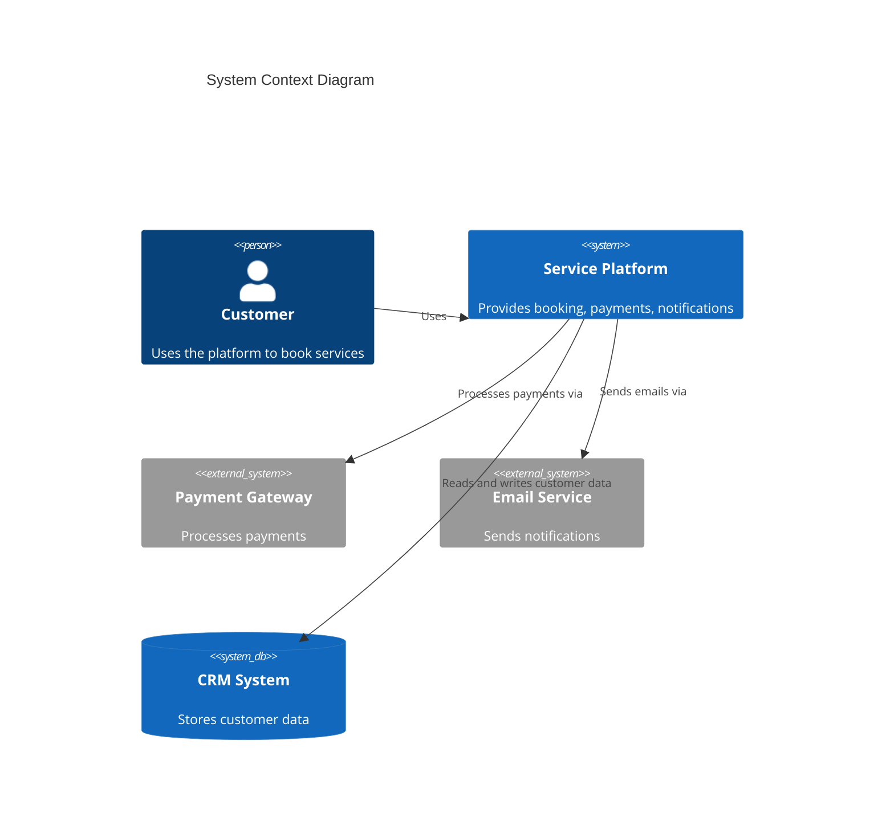

# C4 Level: Context

## Purpose

System Context level provides the highest-level view of the system, showing it as a box surrounded by users and external systems. This level is designed to be understandable by non-technical stakeholders.

## What to Include (Scope)

**Focus on people and software systems:**
- The system itself (as a single box)
- All user personas (human users)
- Programmatic users (external systems, APIs, services)
- External systems the system interacts with
- High-level relationships and data flows
- System purpose and capabilities

**Documentation elements:**
- System overview (short and long descriptions)
- Persona documentation (human and programmatic)
- System features and capabilities
- User journey maps for key features
- External systems and dependencies
- System boundaries (what's inside/outside)

## What to Exclude (Boundaries)

**Avoid technical details:**
- Technologies, protocols, frameworks
- Low-level implementation details
- Code structure
- Deployment architecture
- Internal system components
- Database schemas
- API endpoints

**Not at this level:**
- Container details (save for Container level)
- Component structure (save for Component level)
- Code implementations (save for Code level)

## Key Elements to Show

### In Context Diagrams

Use Mermaid C4Context syntax:
- `Person()` for human users
- `System()` for your system
- `System_Ext()` for external systems
- `SystemDb()` for external databases
- `Rel()` for relationships

### In Documentation

**System Overview:**
- Short description (one sentence)
- Long description (purpose, capabilities, problems solved)

**Personas:**
- Human users (roles, goals, needs)
- Programmatic users (external systems, APIs)
- What each persona wants to achieve
- Features each persona uses

**Features:**
- High-level system capabilities
- Who uses each feature
- Links to user journeys

**User Journeys:**
- Step-by-step journeys for key features
- Both human and programmatic journeys
- All system touchpoints

**External Dependencies:**
- All external systems
- Integration types
- Purpose of each dependency

## When to Use This Level

- Creating the highest-level system overview
- Communicating with non-technical stakeholders
- Documenting system scope and boundaries
- Identifying all users and external dependencies
- Creating the "big picture" view
- Final step after Container and Component documentation

## Examples

### Good Context Diagram


### Good Persona Documentation
```markdown
### Customer
- **Type**: Human User
- **Description**: End user who needs to book services
- **Goals**: Find and book services quickly, track bookings, receive notifications
- **Key Features Used**: Search, Booking, Payment, Notifications
```

### Good User Journey
```markdown
### Booking - Customer Journey
1. Customer searches for available services
2. Customer reviews service details and pricing
3. Customer selects service and booking time
4. Customer enters payment information
5. System processes payment via Payment Gateway
6. System confirms booking and sends notification via Email Service
7. Customer receives confirmation email
```

## Common Mistakes

**Including too much technical detail:**
- ❌ Showing REST vs GraphQL
- ❌ Including database technologies
- ❌ Showing internal components
- ❌ Documenting API endpoints
- ✅ Showing system as a single box
- ✅ Focusing on what the system does, not how

**Missing personas:**
- ❌ Only documenting end users
- ❌ Forgetting programmatic users (APIs, services)
- ✅ Including all user types (human and programmatic)
- ✅ Documenting external systems as "users"

**Unclear system boundaries:**
- ❌ Not defining what's inside vs outside
- ❌ Mixing system features with external systems
- ✅ Clear single system box
- ✅ Everything else is external

**Missing user journeys:**
- ❌ Only listing features
- ❌ No step-by-step flows
- ✅ Complete journeys for key features
- ✅ Including both human and programmatic journeys

**Stakeholder unfriendly:**
- ❌ Technical jargon
- ❌ Implementation details
- ✅ Business language
- ✅ Clear, simple descriptions

## Tips for Effective Context Diagrams

**Keep it simple:**
- System in the center as one box
- Users and external systems around it
- Clear relationships
- Minimal technology details

**Be comprehensive:**
- Include all personas (human and programmatic)
- Don't miss external dependencies
- Document all integration points
- Complete user journey coverage

**Make it stakeholder-friendly:**
- Use business language
- Avoid technical jargon
- Focus on "what" not "how"
- Understandable by non-technical audiences

**Provide context:**
- Explain why external systems exist
- Document business purpose
- Show the big picture
- Connect to business goals

## Workflow Position

- **Input**: Container documentation, component documentation, system docs, tests, requirements
- **After**: C4-Container and C4-Component levels
- **Output**: c4-context.md with system context documentation
- **Purpose**: Synthesize lower levels into stakeholder-friendly overview
