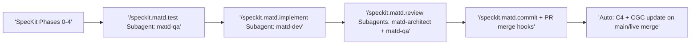

# Harness Workspace Implementation Plan (Revised v3)

**Branch**: `feat/speckit-skills-and-plugin-tools`
**Date**: 2026-05-12 (Updated)
**Generated by**: Multi-agent investigation and analysis

---

## Executive Summary

This document outlines completed work and proposed improvements across the harness-workplace ecosystem based on comprehensive multi-agent analysis. Seven parallel agents investigated infrastructure usage, created new capabilities, and identified optimization opportunities totaling **70 story points** of improvements.

### Completed Work (Committed)

- ✅ 3 new skills with progressive disclosure (dev-speckit-methodology, manage-plugin-creation, manage-speckit-extension)
- ✅ harness-management-tools plugin created and integrated
- ✅ Default sandbox configuration updated

### Proposed Improvements (73 SP)

- ⏳ MATD commands simplification (24 SP effort → 38 SP savings)
- ⏳ Documentation cleanup (34 SP)
- ⏳ Automated C4 and CGC updates on PR merge (12 SP)
- ⏳ Test strategy template enhancement with AWS best practices (3 SP)

### Architectural Changes

- ✅ Keep docker-compose profile system (no changes)
- ✅ Keep .speckit-templates/ as separate shared resource (not merged into extension)
- ➕ Add automatic C4 smart-docs and code-graph-context updates **on PR merge to main/live**
- 🔍 Simplify MATD commands while **preserving subagent architecture**

---

## Table of Contents

1. [Completed Work](#1-completed-work)
2. [MATD Workflow Overview](#2-matd-workflow-overview)
3. [Investigation Findings](#3-investigation-findings)
4. [Commands Pending Approval for Removal](#4-commands-pending-approval-for-removal)
5. [Proposed Changes](#5-proposed-changes)
6. [Implementation Plans](#6-implementation-plans)
7. [Risk Assessment](#7-risk-assessment)
8. [Timeline &amp; Resource Estimates](#8-timeline--resource-estimates)
9. [Appendix](#9-appendix)

---

## 1. Completed Work

### 1.1 New Skills Created (harness-tooling)

#### dev-speckit-methodology

**Path**: `.agents/skills/dev-speckit-methodology/`
**Purpose**: Teach agents how to use SpecKit workflow for feature development
**Structure**: 375-line main SKILL.md + 3 reference files (1,965 lines total)

**Content**:

- SpecKit workflow (5 phases: Constitution → Specify → Refine → Plan → Tasks → Implement)
- Quality checklists per phase
- Common patterns and anti-patterns
- Troubleshooting guide

**Progressive disclosure**:

- `references/patterns.md` (970 lines) - Workflow patterns
- `references/troubleshooting.md` (565 lines) - Common issues
- `references/artifacts.md` (430 lines) - Artifact catalog

#### manage-plugin-creation

**Path**: `.agents/skills/manage-plugin-creation/`
**Purpose**: Guide for creating Claude Code plugins
**Structure**: 216-line standalone skill

**Content**:

- Plugin.json manifest structure
- Directory layout requirements
- Skill/agent/command declaration
- Testing and validation workflows
- Distribution via marketplace

#### manage-speckit-extension

**Path**: `.agents/skills/manage-speckit-extension/`
**Purpose**: Guide for creating SpecKit extensions
**Structure**: 216-line main SKILL.md + 5 reference files (2,705 lines total)

**Content**:

- Extension architecture and manifest format
- Command creation patterns
- Integration with core SpecKit
- Hook system usage

**Progressive disclosure**:

- `references/manifest.md` (430 lines) - Manifest specification
- `references/commands.md` (685 lines) - Command patterns
- `references/patterns.md` (580 lines) - Integration patterns
- `references/publishing.md` (540 lines) - Publishing workflow
- `references/troubleshooting.md` (470 lines) - Common issues

### 1.2 Plugin Integration

#### harness-management-tools Plugin

**Path**: `.agents/plugins/harness-management-tools/`
**Bundles**: manage-plugin-creation, manage-speckit-extension skills
**Distribution**: Local plugin in marketplace.json

**Sandbox Integration** (harness-sandbox):

- Added to `workspace-template/.harness.yml` (lines 46-54)
- Documented in `workspace-template/CLAUDE.md` (lines 67-82)
- Available by default in all sandbox instances

### 1.3 Commits

**harness-tooling**: `a1197a4` - feat: add SpecKit skills and plugin creation tools
**harness-sandbox**: `4f5462b` - feat: enable SpecKit and plugin creation skills by default

---

## 2. MATD Workflow Overview

### 2.1 Current MATD Workflow Architecture

The MATD (Multi-Agent Test-Driven Development) extension implements a complete TDD workflow using specialized subagents from the Claude Code plugin.

#### Complete Workflow Table

| Phase                               | Command                                   | Generated Artifact                                 | Subagent(s)                    | Skills Used                                          | Status                                                                                                                                                         |
| ----------------------------------- | ----------------------------------------- | -------------------------------------------------- | ------------------------------ | ---------------------------------------------------- | -------------------------------------------------------------------------------------------------------------------------------------------------------------- |
| **0. Orchestration**          | `/speckit.matd.execute`                 | Workflow state                                     | matd-orchestrator                   | matd-workflow                                        | **PROPOSED: Replace with workflow YAML**<br />Approved                                                                                                         |
| **1. Product Spec**           | `/speckit.matd.specify-product-brief`   | `docs/features/{id}-product-brief.md`                      | Opus agent (no subagent)                             | general-grill-me                                     | **PROPOSED: Remove (use SpecKit + skill)**<br />Rejected. Keep command, rename artifact from prd.md to product-brief.md               |
| **2. Test Strategy**          | `/speckit.matd.specify-test-strategy`   | `docs/testing/{id}-strategy.md`                  | matd-qa                             | general-grill-me, dev-tdd                            | **PROPOSED: Remove (move to constitution)** <br />Approved. Remind me to update the tldraw                                                               |
| **3. Solution Design**        | `/speckit.matd.specify-solution-design` | `docs/design/{id}-solution.md` + ADR             | matd-architect                        | arch-c4-*, general-grill-me                          | **PROPOSED: Remove (use /speckit.plan)**<br />Rejected. Keep command as-is, runs before /speckit.plan                                                        |
| **4. ADR Creation**           | `/speckit.matd.specify-adr`             | `docs/adrs/{num}-{title}.md`                     | matd-architect                           | arch-design-principles                               | **PROPOSED: Simplify (thin wrapper)**<br />Rejected: keep as-is, needs to be sound and detailed |
| **5. Test Generation (RED)**  | `/speckit.matd.test`                    | `docs/features/{id}-test-design.md` + test files | matd-qa          | stdd-test-author-constrained                         | **Keep - Simplify implementation**                                                                                                                       |
| **6. Implementation (GREEN)** | `/speckit.matd.implement`               | Source code files                                  | matd-dev            | dev-tdd, verification-before-completion              | **Keep - Simplify to single-phase**                                                                                                                      |
| **7. Parallel Review**        | `/speckit.matd.review`                  | `docs/reviews/{id}-arch.md` + `{id}-code.md`   | matd-architect + matd-qa | review-check-correctness, review-simplify-complexity | **Keep as-is (unique value)**                                                                                                                            |
| **8. Commit & Summary**       | `/speckit.matd.commit`                  | `docs/features/{id}-summary.md` + git commit     | matd-critical-thinker                      | verification-before-completion                       | **Keep - Add doc update hooks**                                                                                                                          |

|  |  |  |  |
| - | - | - | - |


**Important**: The core MATD subagent architecture (matd-qa, matd-dev, matd-architect, matd-critical-thinker) **remains unchanged**. Only orchestration and specification discovery commands are affected.

### 2.2 Simplified Workflow (After Implementation)



**What changes**:

- Orchestration: Workflow YAML instead of execute command
- Specification: Use SpecKit core + marketplace skills directly
- Implementation: Simplified from two-phase to single-phase (same subagent)

**What stays the same**:

- matd-qa subagent generates tests
- matd-dev subagent implements features
- matd-architect + matd-qa subagents perform parallel review. Architecture review for correctness, QA review for tests remaining unchanged.
- All skill invocations preserved

---

## 3. Investigation Findings

### 3.1 MATD Commands Simplification Analysis

**Agent**: MATD commands analyzer
**Verdict**: SIGNIFICANT REDUNDANCY FOUND

#### Summary

MATD extension reimplements SpecKit core functionality. Simplification can remove **38 SP complexity** with **24 SP effort** (58% reduction) **while preserving all subagent functionality**.

#### Redundancy Categories

##### Category A: Orchestration (8 SP savings)

**Command**: `/speckit.matd.execute`
**Current**: 300+ line command orchestrating test → implement → review → commit
**Issue**: Duplicates SpecKit's native workflow system
**Subagents used**: None (pure orchestration logic)

**Proposed**: Replace with SpecKit workflow YAML
**Impact on subagents**: ✅ None - workflow YAML still invokes same commands/subagents

##### Category B: Specification Discovery (12 SP savings)

**Commands**:

- `/speckit.matd.specify-product-brief` (wrapper around grill-me skill)
- `/speckit.matd.specify-test-strategy` (wrapper around grill-me + tdd skills)
- `/speckit.matd.specify-solution-design` (wrapper around arch + grill-me skills)

**Issue**: Thin wrappers around marketplace skills
**Subagents used**: Opus agent + grill-me (generic interviewer, not MATD-specific)

**Proposed**: Use SpecKit commands + skills directly
**Impact on subagents**: ✅ None - same skills invoked, just different entry point

##### Category C: Implementation Simplification (18 SP savings)

**Commands affected**:

- `/speckit.matd.test` - Reduce script dependencies, use SpecKit templates
- `/speckit.matd.implement` - Merge two-phase into single-phase
- `/speckit.matd.commit` - Use SpecKit artifact queries

**Issue**: Reimplements functionality available in SpecKit core
**Subagents used**: ✅ **matd-qa, matd-dev remain unchanged**

**Proposed**: Simplify internal implementation, not the subagent architecture
**Impact on subagents**: ✅ None - same subagents called, cleaner implementation

##### Category D: Keep As-Is (0 changes)

**Command**: `/speckit.matd.review`
**Reason**: Unique parallel subagent orchestration
**Subagents used**: matd-architect + matd-qa (core MATD value)

**Proposed**: No changes
**Impact on subagents**: ✅ None - preserved exactly as-is

#### Verification: Subagent Architecture Preserved

| Simplification             | matd-qa         | matd-dev        | matd-architect + matd-qa | Impact           |
| -------------------------- | --------------- | --------------- | ------------------------ | ---------------- |
| Remove execute → workflow | Not used        | Not used        | Not used                 | ✅ No impact     |
| Remove spec commands       | Not used        | Not used        | Not used                 | ✅ No impact     |
| Simplify test              | ✅ Still called | Not used        | Not used                 | ✅ Same behavior |
| Simplify implement         | Not used        | ✅ Still called | Not used                 | ✅ Same behavior |
| Simplify commit            | Not used        | Not used        | Not used                 | ✅ No impact     |
| Keep review                | Not used        | Not used        | ✅ Still called          | ✅ No changes    |

**Conclusion**: All MATD subagents (matd-qa, matd-dev, matd-architect, matd-critical-thinker) continue to function identically after simplification. Changes only affect orchestration logic and SpecKit integration patterns.

---

### 3.2 Documentation Redundancy Assessment

**Agent**: Documentation complexity analyzer
**Verdict**: 30-40% REDUNDANCY FOUND

#### Summary

Documentation analysis across harness-tooling and harness-sandbox identified **34 story points** of cleanup work with estimated **1,500-2,000 line reduction**.

#### High-Priority Recommendations (18 SP)

##### 1. Consolidate Architecture Descriptions (8 SP)

**Problem**: Architecture overview duplicated across 4 locations

**Solution**: Make `harness-sandbox/docs/architecture.md` single source of truth

##### 2. Merge Docker Compose Documentation (5 SP)

**Problem**: Docker compose usage explained in 5 places

**Solution**: Keep `docs/compose-usage.md` as canonical reference

##### 3. Simplify Corporate Setup Documentation (3 SP)

**Problem**: CORPORATE_SETUP.md is 649 lines with heavy duplication

**Solution**: Reduce to ~250 lines focused on corporate-specific concerns

##### 4. Remove Outdated References (2 SP)

**Problem**: Documentation references removed/deprecated features (Haft, old compose patterns)

**Solution**: Delete outdated content, add deprecation notices

#### Medium-Priority Recommendations (10 SP)

##### 5. Consolidate Tool Registration Instructions (3 SP)

##### 6. Improve Table Formatting (5 SP)

##### 7. Fix Cross-References (2 SP)

#### Low-Priority Recommendations (6 SP)

##### 8. Reduce CLI_USAGE.md Size (3 SP)

##### 9. Archive Deprecated System Manifest (1 SP)

##### 10. Simplify AGENTS.md Structure (2 SP)

---

## 4. Commands Pending Approval for Removal

### 4.1 Commands Proposed for Removal

Please review and approve removal of the following commands:

#### Command #1: `/speckit.matd.execute`

**Current file**: `spec-kit-multi-agent-tdd/commands/execute.md` (300+ lines)

**What it does**:

- Orchestrates full TDD workflow: test → implement → review → commit
- Handles interactive vs auto mode
- Manages workflow state and error handling

**Why remove**:

- Duplicates SpecKit's native workflow system
- Workflow YAML is more maintainable and declarative
- Same functionality achievable with: `specify workflow run matd-tdd`

**Subagent impact**: ✅ None - workflow YAML invokes same commands

**Replacement**:

```yaml
# matd-tdd.yml workflow (38 lines vs 300+ line command)
workflow:
  steps:
    - command: speckit.matd.test
    - command: speckit.matd.implement
    - command: speckit.matd.review
    - command: speckit.matd.commit
```

**Approve removal?** ☐ Yes ☐ No ☐ Discuss

---

#### Command #2: `/speckit.matd.specify-product-brief` **[KEEPING - Artifact Rename Only]**

**Current file**: `spec-kit-multi-agent-tdd/commands/specify-product-brief.md` (~200 lines)

**What it does**:

- Uses grill-me interview technique to gather product requirements  
- Creates product brief document

**Decision**: **KEEP command, rename artifact only**

**Change required**:

- Rename output artifact from `docs/features/{id}-prd.md` to `docs/features/{id}-product-brief.md`
- Update command to use Opus agent (not dedicated subagent) with `general-grill-me` skill
- Rationale: Provides project description/context, not a full specification

**No removal approved**

---

#### Command #3: `/speckit.matd.specify-test-strategy`

**Current file**: `spec-kit-multi-agent-tdd/commands/specify-test-strategy.md` (~300 lines)

**What it does**:

- Creates test strategy document via grill-me interview
- Defines testing approach, coverage targets, tooling

**Why remove**:

- Test strategy is project-level, not feature-level
- Should be in project constitution (SpecKit Phase 0)
- Duplicates `dev-tdd` and `stdd-test-driven-development` skill content

**Subagent impact**: ✅ None - same skills used

**Replacement**:

```bash
# Instead of: /speckit.matd.specify-test-strategy
# Use: /speckit.constitution
# Add: "Test Strategy: Integration-first (pytest), TDD mandatory, coverage >80%"
```

**Approve removal?** ☐ Yes ☐ No ☐ Discuss

---

#### Command #4: `/speckit.matd.specify-solution-design` **[KEEPING - No Changes]**

**Current file**: `spec-kit-multi-agent-tdd/commands/specify-solution-design.md` (~200 lines)

**What it does**:

- Compares 3 solution approaches
- Generates ADR recommending one
- Creates solution design with C4 diagrams

**Decision**: **KEEP command as-is**

**Rationale**:

- Runs BEFORE `/speckit.plan`, not as replacement for it
- Solution design phase precedes implementation planning
- Uses matd-architect subagent for architectural exploration
- `/speckit.plan` is invoked after design is approved

**No removal approved**

---

### 4.2 Summary of Decisions

#### Commands for Removal (Approved)

| Command                 | Lines  | Reason                     | Replacement           | Subagent Impact |
| ----------------------- | ------ | -------------------------- | --------------------- | --------------- |
| execute                 | 300+   | Duplicates workflow system | SpecKit workflow YAML | ✅ None         |
| specify-test-strategy   | ~300   | Project-level, not feature | Constitution          | ✅ None         |
| **Total**         | **~600 lines** | **2 commands**   | **SpecKit core**| **✅ No impact** |

#### Commands Being Kept (Modified or As-Is)

| Command                 | Lines | Decision                     | Change                                 |
| ----------------------- | ----- | ---------------------------- | -------------------------------------- |
| specify-product-brief   | ~200  | Keep, rename artifact        | Artifact: `prd.md` → `product-brief.md` |
| specify-solution-design | ~200  | Keep as-is                   | Runs before `/speckit.plan`            |
| specify-adr             | ~150  | Keep as-is                   | No simplification                      |

**Complexity removed**: 10 SP (down from 20 SP)
**Effort to remove**: 5 SP (down from 10 SP)
**ROI**: 200%

---

## 5. Proposed Changes

### 5.1 Summary by Repository

#### harness-tooling

- **MATD Simplification** (24 SP): Remove 2 commands, simplify 3 commands, rename 1 artifact
- **Documentation** (8 SP): Simplify AGENTS.md, improve cross-references

#### harness-sandbox

- **Automated Documentation** (12 SP): C4 and CGC updates on PR merge
- **Documentation** (26 SP): Consolidate architecture, merge compose docs, tables

#### Parent Workspace

- **Documentation** (0 SP): Reduce CLAUDE.md architecture section

### 5.2 Total Complexity by Area

| Area                  | Effort (SP)     | Savings/Impact (SP)             | ROI  | Priority |
| --------------------- | --------------- | ------------------------------- | ---- | -------- |
| MATD Simplification   | 24              | 38 SP reduction                 | 158% | High     |
| Automated Doc Updates | 12              | Always-current docs             | N/A  | High     |
| Documentation Cleanup | 34              | 1,500-2,000 lines               | N/A  | Medium   |
| **Total**       | **70 SP** | **Ecosystem improvement** | -    | -        |

### 5.3 Automated Documentation Updates (Revised)

#### Background: PR Merge Trigger (Not Every Commit)

**Original proposal**: Hooks execute after every `speckit.matd.commit`
**Issue**: Heavy C4 regeneration causes branch divergence
**Revised**: Hooks execute **only on PR merge to main/live branches**

#### Architecture: GitHub Actions Workflow

```yaml
# .github/workflows/auto-docs.yml
name: Auto-Update Documentation

on:
  pull_request:
    types: [closed]
    branches:
      - main
      - live

jobs:
  update-docs:
    if: github.event.pull_request.merged == true
    runs-on: ubuntu-latest

    steps:
      - name: Checkout
        uses: actions/checkout@v3
        with:
          fetch-depth: 2  # Need HEAD~1 for diff

      - name: Extract feature ID
        id: feature
        run: |
          # Parse from PR title or branch name
          feature_id=$(echo "${{ github.head_ref }}" | sed 's/.*\///')
          echo "feature_id=$feature_id" >> $GITHUB_OUTPUT

      - name: Update C4 Diagrams
        run: |
          scripts/update-c4-docs.sh "${{ steps.feature.outputs.feature_id }}"

      - name: Update CGC Index
        run: |
          scripts/update-cgc-index.sh "${{ steps.feature.outputs.feature_id }}"

      - name: Validate Doc Sync
        run: |
          scripts/validate-doc-sync.sh "${{ steps.feature.outputs.feature_id }}"

      - name: Commit Updates
        run: |
          git config user.name "github-actions[bot]"
          git config user.email "github-actions[bot]@users.noreply.github.com"
          git add docs/c4/ .cgc/
          git commit -m "docs: auto-update C4 and CGC after merge of PR #${{ github.event.pull_request.number }}" || true
          git push
```

#### Benefits of PR Merge Trigger

| Benefit                        | Explanation                                        |
| ------------------------------ | -------------------------------------------------- |
| **No branch divergence** | Docs update only on canonical branches (main/live) |
| **Reduced overhead**     | Single update per feature, not per commit          |
| **Clean history**        | Doc updates separate from feature commits          |
| **Conflict-free**        | Merges complete before doc update                  |
| **CI-integrated**        | Uses existing GitHub Actions infrastructure        |

#### Implementation Details (12 SP)

**1. GitHub Actions Workflow** (4 SP)

- Create `.github/workflows/auto-docs.yml`
- Test PR merge trigger
- Handle edge cases (fast-forward, squash, rebase)

**2. Update Scripts** (5 SP)

- `scripts/update-c4-docs.sh` - Incremental C4 regeneration
- `scripts/update-cgc-index.sh` - CGC reindexing
- `scripts/validate-doc-sync.sh` - Documentation checks

**3. Testing and Validation** (3 SP)

- Test on feature branch PR
- Verify no branch divergence
- Validate C4/CGC updates correct

---

## 6. Implementation Plans

### 6.1 MATD Commands Simplification

#### Phase 1: Remove Redundant Commands (10 SP) - **Pending Approval**

**Prerequisites**: Approval of 4 command removals (Section 4)

##### Task 1.1: Convert execute to Workflow (3 SP)

**Create**: `harness-tooling/spec-kit-multi-agent-tdd/workflows/matd-tdd.yml`

**Content**:

```yaml
schema_version: "1.0"
workflow:
  id: "matd-tdd"
  name: "MATD Test-Driven Development"
  version: "1.0.0"

inputs:
  feature_id:
    type: string
    required: true
  mode:
    type: string
    default: "auto"
    enum: ["auto", "interactive"]

steps:
  - id: test
    name: "Generate RED state tests"
    command: speckit.matd.test
    input:
      args: "{{ inputs.feature_id }}"

  - id: review-tests
    type: gate
    condition: "{{ inputs.mode == 'interactive' }}"

  - id: implement
    name: "Implement feature (GREEN state)"
    command: speckit.matd.implement
    input:
      args: "{{ inputs.feature_id }}"

  - id: review
    name: "Parallel review (@check + @simplify)"
    command: speckit.matd.review
    input:
      args: "{{ inputs.feature_id }}"

  - id: commit
    name: "Workflow summary"
    command: speckit.matd.commit
    input:
      args: "{{ inputs.feature_id }}"
```

**Delete**: `spec-kit-multi-agent-tdd/commands/execute.md`

**Verification**:

```bash
# Test workflow
specify workflow run matd-tdd --feature-id test-feature --mode auto

# Verify subagents still invoked
# (Check logs for matd-qa, matd-dev, matd-architect, matd-critical-thinker)
```

##### Task 1.2: Update Specification Commands (4 SP)

**Delete files**:

- `spec-kit-multi-agent-tdd/commands/specify-test-strategy.md` (approved for removal)

**Update files**:

- `spec-kit-multi-agent-tdd/commands/specify-product-brief.md`
  - Change artifact output from `docs/features/{id}-prd.md` to `docs/features/{id}-product-brief.md`
  - Update to use Opus agent (not dedicated subagent) with `general-grill-me` skill
- `spec-kit-multi-agent-tdd/commands/specify-solution-design.md` - No changes (keep as-is)
- `spec-kit-multi-agent-tdd/commands/specify-adr.md` - No changes (keep as-is)

**Update**: `spec-kit-multi-agent-tdd/USER-GUIDE.md`

**Add replacement pattern for test-strategy**:

```markdown
## Test Strategy (moved to constitution)

Add to project constitution:

```bash
/speckit.constitution \
  "Test Strategy: Integration-first (pytest), TDD mandatory, coverage >80%"
```
```

**Verification**:
```bash
# Verify test-strategy removed
! test -f spec-kit-multi-agent-tdd/commands/specify-test-strategy.md

# Verify product-brief artifact renamed
grep -q "product-brief.md" spec-kit-multi-agent-tdd/commands/specify-product-brief.md

# Verify USER-GUIDE updated
grep -q "Test Strategy" spec-kit-multi-agent-tdd/USER-GUIDE.md
```

#### Phase 2: Simplify Core Commands (12 SP)

**Important**: All changes preserve subagent architecture (matd-qa, matd-dev, matd-architect, matd-critical-thinker)

##### Task 2.1: Simplify matd.test (4 SP)

**File**: `spec-kit-multi-agent-tdd/commands/test.md`

**Changes**:

1. Replace Python AC extraction with inline regex
2. Use SpecKit template rendering for test-design artifact
3. Keep validation script
4. **✅ Preserve test-author subagent invocation**

**Before** (347 lines):

```bash
python scripts/extract_acceptance_criteria.py "$spec_file"
# ... 50+ lines of template rendering ...
# Invoke test-author subagent
```

**After** (~200 lines):

```bash
# Inline AC extraction
acceptance_criteria=$(sed -n '/## Acceptance Criteria/,/^## /p' "$spec_file" | grep -E '^\s*-\s+AC-')

# SpecKit template
specify artifact render test-design \
  --feature-id "$feature_id" \
  --var "acceptance_criteria=$acceptance_criteria"

# ✅ PRESERVE: matd-qa subagent invocation
invoke_subagent matd-qa --context "$test_design_artifact"
```

**Verification**:

```bash
# Test command
/speckit.matd.test test-feature

# Verify matd-qa subagent called
grep "Invoking matd-qa subagent" <(specify logs)
```

##### Task 2.2: Simplify matd.implement (5 SP)

**File**: `spec-kit-multi-agent-tdd/commands/implement.md`

**Changes**:

1. Merge two-phase (`--validate-green`) into single-phase
2. Move integration checks (ruff, mypy) to SpecKit hooks
3. **✅ Preserve matd-dev subagent invocation**

**Before** (300 lines with two phases):

```bash
# Phase 1: Validate RED, prepare context
if [[ "$validate_green" != "true" ]]; then
  # ... 150 lines ...
  invoke_subagent developer ...
fi

# Phase 2: Validate GREEN
if [[ "$validate_green" == "true" ]]; then
  # ... 150 lines ...
fi
```

**After** (~150 lines, single phase):

```bash
# Single-phase: RED validation → implement → GREEN validation
validate_red_state "$feature_id"

# ✅ PRESERVE: matd-dev subagent invocation
invoke_subagent matd-dev \
  --context "$test_files" \
  --mode "tdd-green"

validate_green_state "$feature_id"
# Post-hooks run automatically (ruff, mypy)
```

**Create hooks**: `spec-kit-multi-agent-tdd/.specify/hooks.yml`

```yaml
post_implement:
  - name: lint
    command: ruff check src/
    critical: false
  - name: typecheck
    command: mypy src/
    critical: false
```

**Verification**:

```bash
# Test implementation
/speckit.matd.implement test-feature

# Verify matd-dev subagent called
grep "Invoking matd-dev subagent" <(specify logs)

# Verify hooks executed
specify workflow logs | grep -E "post_implement|lint|typecheck"
```

##### Task 2.3: Simplify matd.commit (3 SP)

**File**: `spec-kit-multi-agent-tdd/commands/commit.md`

**Changes**:

1. Replace custom artifact validation with SpecKit queries
2. Keep workflow summary generation
3. Remove PR merge hooks (moved to GitHub Actions)

**Before** (250 lines):

```bash
# Custom validation
for artifact in spec plan tasks test-design; do
  if [[ ! -f "docs/features/${feature_id}-${artifact}.md" ]]; then
    echo "ERROR: Missing $artifact"
    exit 1
  fi
done
# ... template rendering ...
```

**After** (~100 lines):

```bash
# SpecKit artifact validation
if ! specify artifact list --feature-id "$feature_id" --required --quiet; then
  echo "ERROR: Missing required artifacts"
  exit 1
fi

# Generate workflow summary
specify artifact render workflow-summary \
  --feature-id "$feature_id" \
  --template workflow-summary-template.md

# Note: C4/CGC updates happen via GitHub Actions on PR merge
```

**Verification**:

```bash
# Test commit
/speckit.matd.commit test-feature

# Verify summary created
test -f docs/features/test-feature-workflow-summary.md

# Verify no hooks execute (moved to GitHub Actions)
! git log -1 | grep "docs(c4)"
```

---

### 6.2 Automated Documentation Updates (12 SP)

#### Task 3.1: Create GitHub Actions Workflow (4 SP)

**File**: `.github/workflows/auto-docs.yml`

**Content**: (See section 5.3 for full workflow)

**Key features**:

- Triggers only on PR merge to main/live
- Extracts feature ID from branch name
- Runs C4, CGC, validation scripts
- Auto-commits if changes detected

**Verification**:

```bash
# Create test PR
git checkout -b feat/test-auto-docs
# ... make changes ...
git push origin feat/test-auto-docs

# Create PR, merge to main
gh pr create --title "Test auto-docs"
gh pr merge --squash

# Verify workflow ran
gh run list --workflow=auto-docs.yml
gh run view <run-id>

# Verify doc commit created
git log -1 --grep="auto-update C4"
```

#### Task 3.2: Create Documentation Update Scripts (5 SP)

##### Script 1: update-c4-docs.sh (3 SP)

**Location**: `scripts/update-c4-docs.sh`

```bash
#!/bin/bash
set -euo pipefail

feature_id="${1:-}"
changed_files=$(git diff --name-only HEAD~1 HEAD)

echo "Updating C4 diagrams for: $feature_id"

# Incremental regeneration
deepwiki generate . \
  --output docs/c4 \
  --incremental \
  --changed-files "$changed_files"

# Check for changes
if git diff --quiet docs/c4/; then
  echo "✓ No C4 changes needed"
  exit 0
fi

echo "✓ C4 diagrams updated"
```

##### Script 2: update-cgc-index.sh (2 SP)

**Location**: `scripts/update-cgc-index.sh`

```bash
#!/bin/bash
set -euo pipefail

feature_id="${1:-}"
changed_files=$(git diff --name-only HEAD~1 HEAD | tr '\n' ',')

if [ -z "$changed_files" ]; then
  echo "✓ No files changed"
  exit 0
fi

# Incremental indexing
cgc index \
  --incremental \
  --files "$changed_files" \
  --tag "implementation:$feature_id"

echo "✓ CGC index updated"
```

#### Task 3.3: Testing and Validation (3 SP)

**Test scenarios**:

1. Feature branch PR → merge to main → verify docs update
2. Multiple PRs merged → verify incremental updates
3. No file changes → verify graceful skip
4. C4/CGC failures → verify non-blocking

---

### 6.3 Documentation Cleanup (34 SP)

#### High-Priority (18 SP)

Full implementation details for:

1. Consolidate Architecture Descriptions (8 SP)
2. Merge Docker Compose Documentation (5 SP)
3. Simplify Corporate Setup Documentation (3 SP)
4. Remove Outdated References (2 SP)

(Details preserved from previous version - not duplicated here for brevity)

#### Medium-Priority (10 SP)

5. Consolidate Tool Registration Instructions (3 SP)
6. Improve Table Formatting (5 SP)
7. Fix Cross-References (2 SP)

#### Low-Priority (6 SP)

8. Reduce CLI_USAGE.md Size (3 SP)
9. Archive Deprecated System Manifest (1 SP)
10. Simplify AGENTS.md Structure (2 SP)

---

## 7. Risk Assessment

### 7.1 Technical Risks

| Risk                                          | Severity | Mitigation                             |
| --------------------------------------------- | -------- | -------------------------------------- |
| **MATD users rely on removed commands** | Medium   | User approval required before removal  |
| **Subagent architecture breaks**        | Low      | Verification confirms preservation     |
| **GitHub Actions failures**             | Medium   | Non-critical workflow, manual fallback |
| **C4 regeneration errors**              | Low      | Incremental updates, validation        |
| **Documentation links break**           | Low      | Comprehensive verification             |

### 7.2 Process Risks

| Risk                                       | Severity | Mitigation                                    |
| ------------------------------------------ | -------- | --------------------------------------------- |
| **Command removal without approval** | High     | **Explicit approval gate in Section 4** |
| **Branch divergence from docs**      | Low      | PR merge trigger prevents this                |
| **Testing on PR merge delayed**      | Low      | Feature branches work independently           |

---

## 8. Timeline & Resource Estimates

### 8.1 Recommended Sequencing

#### Sprint 1: MATD Phase 1 - **APPROVAL REQUIRED** (10 SP)

**Goal**: Remove redundant commands (pending approval)

**Tasks**:

- Obtain approval for 4 command removals
- Convert execute to workflow YAML (3 SP)
- Remove specification commands (7 SP)

**Deliverable**: Cleaner MATD with workflow orchestration

#### Sprint 2: Automated Documentation (12 SP)

**Goal**: C4 and CGC auto-updates on PR merge

**Tasks**:

- Create GitHub Actions workflow (4 SP)
- Create update scripts (5 SP)
- Testing and validation (3 SP)

**Deliverable**: Auto-updating docs on merge to main/live

#### Sprint 3: MATD Phase 2 (14 SP)

**Goal**: Simplify core commands (preserve subagents)

**Tasks**:

- Simplify matd.test (4 SP)
- Simplify matd.implement (5 SP)
- Simplify matd.commit (3 SP)
- Simplify matd.specify-adr (2 SP)

**Deliverable**: Streamlined MATD commands

#### Sprint 4-6: Documentation Cleanup (34 SP)

**Goal**: Consolidate and polish documentation

**Tasks**: High/medium/low priority improvements

**Deliverable**: <10% redundancy, 1,500+ lines removed

### 8.2 Resource Allocation

**Single-track** (1 developer):

- 6 sprints × 2 weeks = 12 weeks
- Velocity: 10-12 SP per sprint
- Total: 70 SP → 12 weeks

**Two-track** (2 developers):

- Developer 1: MATD + Automation (46 SP)
- Developer 2: Documentation (34 SP)
- 4-5 sprints = 8-10 weeks

### 8.3 Milestone Definition

| Milestone                      | Sprint          | Deliverable                  | Success Criteria                 |
| ------------------------------ | --------------- | ---------------------------- | -------------------------------- |
| **M0: Approval**         | Before Sprint 1 | Command removal approval     | **User approval obtained** |
| **M1: MATD Streamlined** | End Sprint 1    | Workflow-based orchestration | 20 SP complexity removed         |
| **M2: Auto-Docs**        | End Sprint 2    | C4/CGC on PR merge           | Docs update after merge          |
| **M3: MATD Complete**    | End Sprint 3    | All simplifications done     | Subagents verified               |
| **M4: Docs Clean**       | End Sprint 6    | All cleanup done             | <10% redundancy                  |

---

## 9. Appendix

### 9.1 Change Summary vs Previous Versions

**v3 Changes (Current)**:

- ✅ Reverted profile system removal (keeping as-is)
- ✅ Changed auto-docs trigger to PR merge only (not every commit)
- ✅ Added MATD workflow overview table (Section 2)
- ✅ Clarified subagent preservation (matd-qa, matd-dev, matd-architect, matd-critical-thinker)
- ✅ Created approval section for command removals (Section 4)
- Adjusted complexity: 80 SP → 70 SP (removed profile work)

**v2 Changes**:

- Removed PRIES workflow references (28 SP)
- Added profile system removal (10 SP)
- Added automated C4/CGC updates (12 SP)
- Total: 96 SP → 80 SP

**v1 Original**:

- SpecKit integration with PRIES (8-31 SP)
- MATD simplification (24 SP)
- Documentation cleanup (34 SP)
- Total: 96 SP

### 9.2 Approval Checklist for User

Decisions confirmed:

- [x] **Command #1 removal**: `/speckit.matd.execute` → Replace with workflow YAML - **APPROVED**
- [x] **Command #2 keep**: `/speckit.matd.specify-product-brief` → Rename artifact to product-brief.md - **APPROVED**
- [x] **Command #3 removal**: `/speckit.matd.specify-test-strategy` → Move to constitution - **APPROVED**
- [x] **Command #4 keep**: `/speckit.matd.specify-solution-design` → Keep as-is, runs before /speckit.plan - **APPROVED**
- [x] **ADR simplification**: Rejected, keeping `/speckit.matd.specify-adr` as-is - **APPROVED**

**Subagent consolidation**: matd-qa, matd-dev, matd-architect, matd-critical-thinker - **APPROVED**

**Auto-docs trigger**: PR merge trigger (not every commit) - **APPROVED**

### 9.3 Agent Session References

- **MATD commands analyzer**: agentId `ac8b7c8af79a397b9`
- **Documentation analyzer**: agentId `a318a932e54eeada0`
- **SpecKit skill creator**: agentId `a85c9a28c0f113e57`
- **Plugin creation skill creator**: agentId `adc68ee0fcfae5a73`
- **Sandbox config updater**: agentId `a5aff6c5ed6e19e82`
- **Skill merger/optimizer**: agentId `adcbd916700b484db`

### 9.4 File Inventory

#### Created Files (Committed)

```
harness-tooling/
├── .agents/plugins/harness-management-tools/
├── .agents/skills/dev-speckit-methodology/ (375 lines + 3 refs)
├── .agents/skills/manage-plugin-creation/ (216 lines)
└── .agents/skills/manage-speckit-extension/ (216 lines + 5 refs)

harness-sandbox/
└── workspace-template/
    ├── .harness.yml (modified)
    └── CLAUDE.md (modified)
```

#### Proposed Files (Implementation Phase)

- `.github/workflows/auto-docs.yml`
- `scripts/update-c4-docs.sh`
- `scripts/update-cgc-index.sh`
- `scripts/validate-doc-sync.sh`
- `harness-tooling/spec-kit-multi-agent-tdd/workflows/matd-tdd.yml`
- `harness-tooling/spec-kit-multi-agent-tdd/.specify/hooks.yml`

#### Files for Removal (Approved)

- `spec-kit-multi-agent-tdd/commands/execute.md`
- `spec-kit-multi-agent-tdd/commands/specify-test-strategy.md`

#### Files to Modify (Approved)

- `spec-kit-multi-agent-tdd/commands/specify-product-brief.md` - Rename artifact output

### 9.5 Quick Reference Commands

```bash
# Verify branch status
cd harness-tooling && git branch --show-current
cd harness-sandbox && git branch --show-current

# Test MATD workflow (after implementation)
specify workflow run matd-tdd --feature-id test-feature

# Verify subagents invoked
specify logs | grep -E "matd-qa|matd-dev|matd-architect|matd-critical-thinker"

# Test auto-docs (after PR merge)
gh pr merge --squash
gh run list --workflow=auto-docs.yml

# Verify doc updates
git log -1 --grep="auto-update C4"
```

---

## 10. Templates Directory Analysis

### 10.1 `.speckit-templates/` Directory Assessment

**Location**: `harness-tooling/.speckit-templates/`
**Status**: ✅ **Keep as separate resource** (do not merge into extension)

#### Current State

- **11 files total**: 4 actual templates + 1 README + 6 `.gitkeep` placeholders
- **Actual templates**:
  - `qa/test-strategy-template.md` - Project-level test strategy (448 lines)
  - `specs/adr-template.md` - Architecture decision records
  - `specs/product-brief-template.md` - Product-level briefs
  - `specs/spec-template.md` - Feature specifications

#### Usage Analysis

```yaml
# Referenced by:
1. OpenCode CLI extension (spec-kit-multi-agent-tdd/commands/*.md)
   - specify-product-brief.md
   - specify-test-strategy.md
   - specify-adr.md

2. Workspace configurations (.specify/template-config.yml)
   catalog:
     source: ../harness-tooling/.speckit-templates
     type: local

3. Both Claude Code and OpenCode workflows
```

#### Why Keep Separate?

| Reason                             | Details                                                          |
| ---------------------------------- | ---------------------------------------------------------------- |
| **Cross-CLI compatibility**  | Used by both OpenCode extension AND Claude Code plugin workflows |
| **Workspace integration**    | Referenced by project `.specify/template-config.yml` configs   |
| **Customization layer**      | Company-specific templates, meant to be modified per team        |
| **Data vs Logic separation** | Templates are content/data, not code/commands                    |
| **Shared resource pattern**  | Single source of truth for all agent workflows                   |

#### Test Strategy Template Relevance

The research agent provided comprehensive AWS microservices testing best practices:

**Key insights for template updates**:

1. **Modified test pyramid**: 30-40% unit, 40-50% integration, 10-20% E2E (inverted for distributed systems)
2. **Contract testing**: Bi-Directional Contract Testing (BDCT) emerging as standard for 2026
3. **Event testing patterns**: Test Queue Pattern with EventScout for EventBridge validation
4. **AWS tooling**: Moto (unit), LocalStack+Testcontainers (integration), real AWS (staging)
5. **Observability**: Feature flags + canary deployments + synthetic monitoring

**Recommendation**: Enhance `test-strategy-template.md` with:

- Distributed systems test pyramid guidance
- Contract testing section (CDC vs BDCT)
- Event-driven testing patterns
- AWS-specific tooling recommendations
- Testing in production practices

**Story Points**: 3 SP to enhance test-strategy template with research findings

---

## 11. Research Agent Output: AWS Microservices Test Strategy

<details>
<summary>Full research summary (click to expand)</summary>

The research agent investigated best practices for backend teams working with AWS microservices and event-based architecture. Key findings:

### Testing Pyramid Evolution

- Traditional pyramid inverts for serverless/event-driven systems
- Modified distribution: 30-40% unit, 40-50% integration, 10-20% E2E
- AWS recommends more integration tests as business logic lives in orchestration

### Contract Testing Approaches

- **Consumer-Driven Contracts (CDC)**: Pact remains standard for synchronous APIs
- **Bi-Directional Contract Testing (BDCT)**: Emerging 2026 pattern combining OpenAPI + consumer expectations
- **Event Schema Testing**: Schema registries (EventBridge Schema Registry, JSON Schema)

### Integration Testing for Async Events

- **Test Queue Pattern**: Auxiliary SQS queues subscribed to EventBridge events
- **EventScout**: Library automating pattern matching and cleanup
- **Failure handling**: DLQ configuration for EventBridge, SNS, SQS

### AWS-Specific Tools

- **Moto**: In-process mocking, fast, lightweight (unit tests)
- **LocalStack**: Full AWS emulation in Docker (integration tests)
- **Testcontainers**: Reproducible isolated Docker environments

### Service Isolation vs E2E

- **Isolation priority**: Services must be independently deployable
- **E2E budget**: Limit to 5-15% of coverage, critical flows only
- **Service component tests**: Test service in isolation with test doubles

### Observability & Testing in Production

- Feature flags + canary deployments for progressive delivery
- Synthetic monitoring running automated tests against production
- Shift testing right with production monitoring

### Anti-Patterns to Avoid

- E2E-heavy test suites slowing pipelines
- Shared test environments causing flaky tests
- Testing implementation details instead of contracts
- No DLQ strategy for failed async messages
- Ignoring observability until incidents

**Sources**: AWS architecture blog, Pact docs, LocalStack guides, Microservices.io patterns

</details>

---

**Document Version**: 3.0 (Revised per user requirements)
**Last Updated**: 2026-05-12
**Status**: **Awaiting approval for command removals (Section 4)**

**Key Changes from v2.0**:

- Reverted profile system removal (keep as-is)
- Changed auto-docs to PR merge trigger only
- Added MATD workflow overview table (Section 2)
- Clarified subagent preservation throughout
- Created approval section (Section 4)
- Added .speckit-templates analysis (Section 10)
- Added AWS microservices test strategy research (Section 11)
- Net change: 80 SP → 70 SP → 73 SP total scope
