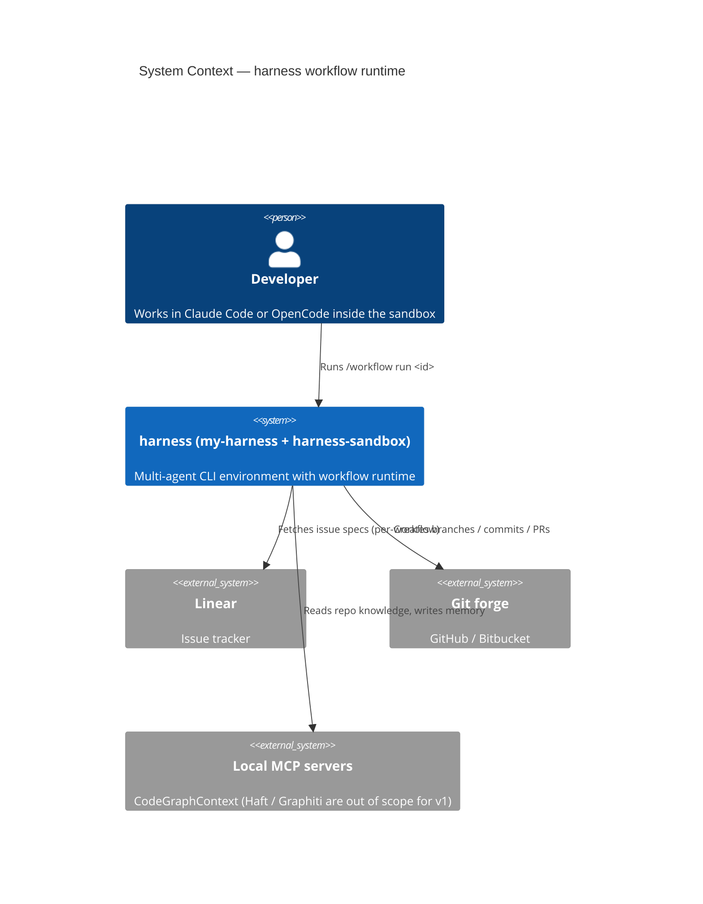
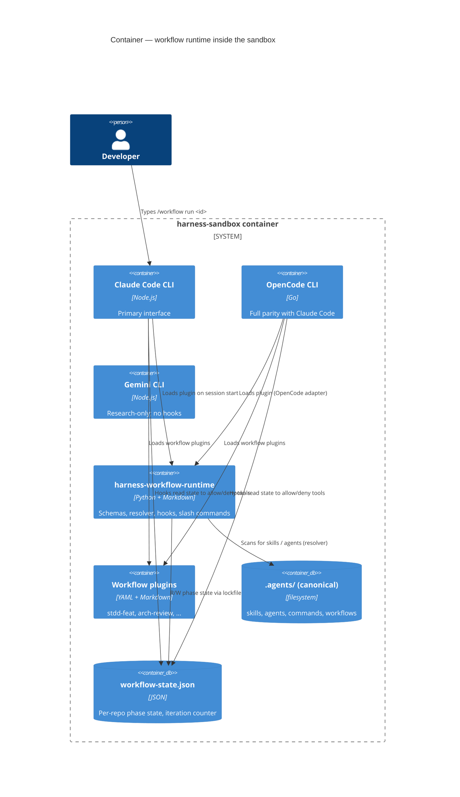
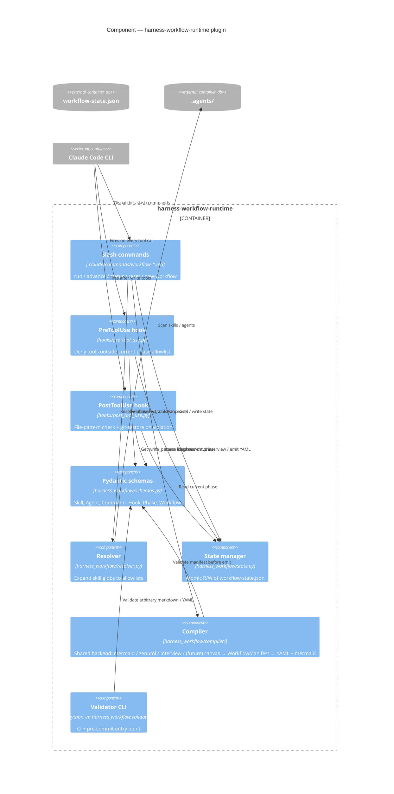

# `harness-workflow-runtime` — Implementation Plan & C4 Architecture

**Status:** Draft, awaiting approval to start Phase R
**Created:** 2026-04-23
**Companion:** [WORKFLOW_ORCHESTRATOR_REQUIREMENTS.md](WORKFLOW_ORCHESTRATOR_REQUIREMENTS.md) — scope & feature spec
**Parent:** [harness-v1-master-plan.md](harness-v1-master-plan.md) — v1 workspace rollout (workspace topology, sandbox, marketplace restructure)

---

## 1. Purpose

Deliver the **`harness-workflow-runtime` plugin** — the prerequisite runtime that turns the marketplace's phase-manifest YAML into hard-enforced, inspectable, step-wise multi-agent workflows for Claude Code and OpenCode. Enable per-workflow plugins (`stdd-feat`, `arch-review`, …) to declare phases in YAML and have them enforced without writing Python themselves.

## 2. Non-goals

- **Not** an agent framework. Uses Claude Code's native subagent/Task primitive and OpenCode's equivalent; does not build a new one.
- **Not** a workflow *engine* in the Kestra / Airflow sense. No scheduler, no daemon. Execution is driven by the CLI session.
- **Not** Gemini-parity. Gemini gets scoped extensions for research; no hooks, no state machine.
- **Not** a GUI editor in v1. Tier 3 GUI canvas deferred to v1.2+ after dogfooding Tiers 1 + 2. See requirements §18.
- **Not** Stepstone-specific. This plugin is OSS. Stepstone overlays live elsewhere.

## 3. Terminology

| Term | Meaning |
|---|---|
| **Workflow manifest** | A YAML file declaring a named workflow: a list of phases, their drivers, workers, skill globs, constraints, and gates. |
| **Phase** | One unit of work. Has a driver agent and zero-or-more worker subagents. Produces one or more artifacts. Gated on entry and exit. |
| **Driver agent** | The agent whose Task-tool invocation *is* the phase. Usually an orchestrator. |
| **Worker agent** | A subagent the driver spawns inside the phase. |
| **Resolver** | The module that reads skill globs from a workflow manifest and emits explicit CLI-native ACLs at session start. |
| **State file** | `<repo>/.claude/workflow-state.json` — current workflow, current phase, iteration counter, artifact pointers. Read by hooks, written by `/workflow advance`. |
| **Runtime plugin** | `harness-workflow-runtime`. The subject of this plan. |
| **Workflow plugin** | A separately-versioned plugin declaring a workflow manifest + its agents/skills/hooks. Depends on the runtime plugin. |

---

## 4. C4 Context

Lightweight — the broader harness context is in the master plan. This plan zooms in on the developer ↔ workflow-runtime boundary.



## 5. C4 Container

Shows the runtime plugin's role inside the sandbox alongside the CLIs, the marketplace, and the state file.



## 6. C4 Component — inside `harness-workflow-runtime`



## 7. C4 Code — key modules

Minimal — showing only the two modules with non-trivial state or control flow.

**`harness_workflow/state.py`** — atomic state machine:

```
StateManager
├─ load() → WorkflowState | None       (reads JSON, validates via pydantic)
├─ init(workflow_id, manifest) → None  (lock, write initial state)
├─ advance(artifact) → PhaseState      (validate prior artifact, bump phase)
├─ retry() → PhaseState                (bump iteration counter; respect max)
├─ escalate(reason) → None             (mark escalated, halt advance)
└─ reset(confirm=True) → None          (wipe state file)

Locking: fcntl advisory lock on state file; 5s timeout, then fail.
```

**`harness_workflow/resolver.py`** — deterministic glob expansion:

```
Resolver
├─ scan_marketplace(root: Path) → dict[skill_name, SkillMeta]
├─ expand_globs(patterns: list[str], catalog) → list[str]
│    # supports "stdd-pm-*", "!foo-bar", union semantics
├─ compile_phase_acl(phase: PhaseManifest) → PhaseACL
│    # resolves skills; maps to allowedTools (Claude) and permission.skill (OpenCode)
└─ emit_claude_acl(acl) / emit_opencode_acl(acl) → dict
```

**`harness_workflow/compiler/`** — multi-front-end compiler to `WorkflowManifest`:

```
compiler/
├─ mermaid_sequence.py   # parse mermaid `sequenceDiagram` → WorkflowManifest
├─ interview.py          # step-graph Q&A → WorkflowManifest (re-asks on validation failure)
└─ emit.py               # WorkflowManifest → canonical workflow.yaml + workflow.mmd
```

All front-ends share one pydantic target (`WorkflowManifest`) and one emitter. Tier 3 (GUI canvas, v1.2+) will add a fourth front-end (`canvas_json.py`) without changing the schema or the emitter.

All modules are pure Python with small surface areas — easy to unit-test in isolation.

---

## 8. Implementation phases

Sequential; later phases depend on earlier ones. Rough effort estimates assume one engineer, full focus; treat as upper bounds, not commitments.

### Phase R — Research & baseline (0.5 d)

- Inventory `.agents/` frontmatter styles currently in use; catch outliers.
- Pin upstream versions: `pydantic>=2.10`, `pydantic-ai-skills>=<current>`, `PyYAML>=6`.
- **Verify Python 3.13 availability in the pinned OpenShell-Community base image.** If absent, produce one of the three mitigation paths from §13 for sign-off before Phase 0 starts.
- Confirm Claude Code hook contract version.
- Confirm OpenCode hook API shape via froggy (the chosen plugin host per §13).
- **Define the mermaid subset** we support for Tier 1 authoring (participants, messages, `par`, `loop`, notes, bracket-metadata convention). Decide whether to include zenuml in v1 or defer to v1.1.

**Deliverable:** short report in `docs/research-workflow-runtime-baseline.md` + draft of `docs/workflow-runtime-mermaid-grammar.md`. No code.

### Phase 0 — Schema (1 d)

- Write `harness_workflow/schemas.py`:
  - `Skill` (subclass `pydantic_ai_skills.Skill` if open to it; else free-standing).
  - `Agent` (dual Claude `skills:` + OpenCode `permission.skill`).
  - `Command` (Claude slash-command frontmatter).
  - `HookEntry` (settings.json hook shape).
  - `PhaseManifest` (driver, workers, skills globs, constraints, gates, convergence).
  - `WorkflowManifest` (name, description, phases, version, runtime_min_version).
- Write validator entry point: `python -m harness_workflow.validate [path ...]`.
- Ship as a `pyproject.toml`-installable Python package under the runtime plugin root.

**Acceptance:** running the validator on the current `.agents/` tree either passes cleanly or lists every offender with an actionable error. No false positives.

### Phase 1 — Runtime plugin scaffold (1 d)

- `.claude-plugin/plugin.json` for the runtime plugin (marketplace manifest).
- Installer-friendly layout: `harness-workflow-runtime/` at marketplace root with `commands/`, `hooks/`, `harness_workflow/` (Python pkg), `README.md`.
- No-op slash command + no-op hook. Smoke: install plugin, hook fires, command runs, nothing else happens.

**Acceptance:** fresh clone + `claude plugin install <path>` + `claude /workflow` → command found; tool calls invoke the no-op hook.

### Phase 2 — Resolver (1 d)

- Implement `resolver.py` per §7.
- Unit tests covering: basic glob, negation, conflict resolution, empty marketplace, unknown skill in glob.
- Emitters for Claude `allowedTools` and OpenCode `permission.skill`.

**Acceptance:** given a fixture marketplace + a sample workflow, resolver produces the expected ACL dict (snapshot test).

### Phase 3 — State manager + slash commands (1.5 d)

- `state.py` with fcntl locking.
- `.claude/commands/workflow-run.md` — args: `<workflow-id>`. Reads workflow manifest, initializes state, prompts user to start phase 1.
- `.claude/commands/workflow-advance.md` — validates prior artifact, bumps phase, emits new ACL.
- `.claude/commands/workflow-status.md` — pretty-prints state.
- `.claude/commands/workflow-reset.md` — wipes state (with confirmation).

**Acceptance:** happy-path transcript from `/workflow run stdd-feat` → `/workflow advance` through all phases of a toy workflow, with state file contents shown after each step.

### Phase 4 — Hooks (1 d)

- `hooks/pre_tool_use.py`: reads current phase ACL, denies tools outside allowlist with exit 2 + block reason.
- `hooks/post_tool_use.py`: on Write/Edit/Bash with write side-effects, validates file-pattern constraint; on violation, `git restore` the offending path and exit 2.
- Register both in `settings.json` under `PreToolUse` / `PostToolUse`.

**Acceptance:** adversarial test — the driver agent attempts a tool outside the phase allowlist; hook blocks it; state file unchanged; workflow can still advance by legitimate means.

### Phase 5 — Compiler: mermaid sequence parser + emitter (1.5 d) — primary Tier 1 UX

- Implement `harness_workflow/compiler/`:
  - `mermaid_sequence.py` — parse mermaid `sequenceDiagram` into `WorkflowManifest`. Participants → agents; messages → phases; `par` blocks → parallel phases; `loop` blocks → convergence-gated phases; inline metadata in notes or bracket convention (e.g. `[skills: stdd-pm-*; writes: docs/tickets/**]`).
  - `interview.py` — step-graph Q&A backend (prototype shell; Phase 6 fleshes it out).
  - `emit.py` — `WorkflowManifest` → canonical `workflow.yaml` and `workflow.mmd`.
- Finalise the supported mermaid subset in `docs/workflow-runtime-mermaid-grammar.md`.
- Round-trip unit tests against the canonical TDD example: mermaid → YAML → mermaid, assertions on structural equivalence; lossy fields reported, not silently dropped.

**Acceptance:** a hand-authored TDD mermaid sequence diagram parses into a valid manifest; re-emitted diagram is structurally equivalent; lossy fields are listed in the compiler's report.

### Phase 6 — `/new-workflow` interview command (0.5 d)

- Flesh out `compiler/interview.py` and the `.claude/commands/new-workflow.md` front.
- On validation failure, the command re-asks the offending step with the pydantic error message inlined.
- Emits `workflow.yaml` + `workflow.mmd` via the same `emit.py` used by Phase 5.

**Acceptance:** author a workflow from scratch in one sitting; file passes validator; mermaid renders in GitHub preview.

### Phase 7 — Example workflow: `stdd-feat` (0.5 d)

- Convert the existing `stdd-feat-workflow` command + STDD agents into a workflow-plugin-shaped manifest.
- Ensure `stdd-01…04` still usable standalone (backward compat).
- One end-to-end smoke: `/workflow run stdd-feat` on a trivial fixture issue.

**Acceptance:** dogfooding — complete one real Linear ticket through the new runtime before calling v1 done.

### Phase 8 — OpenCode parity (1 d)

- OpenCode plugin (froggy-compatible) with the same hook contract.
- Same Python modules under the hood; OpenCode-specific adapters in `harness_workflow/adapters/opencode.py`.
- `permission.skill` ACL emission from the resolver.

**Acceptance:** same smoke test as Phase 7 but from OpenCode.

### Phase 9 — Documentation & handoff (0.5 d)

- Installation quickstart in `harness-workflow-runtime/README.md`.
- Troubleshooting: common hook-denial reasons, how to inspect state, how to reset cleanly.
- `docs/workflow-runtime-mermaid-grammar.md` finalised with worked examples.
- Update `my-harness/CLAUDE.md` to reference the runtime plugin.
- Update the v1 master plan's "target end state" tree to include `harness-workflow-runtime/`.

**Acceptance:** one teammate, no prior context, installs and runs `stdd-feat` end-to-end following the README alone.

**Total:** ~9.5 engineer-days. Phase 5 is the main v1 addition vs. the prior estimate. Not parallelisable beyond Phase 2 vs. Phase 3 (after Phase 0/1 land); Phase 6 depends on Phase 5's compiler backend.

---

## 9. Deliverable file inventory

```
my-harness/
  .agents/
    plugins/
      harness-workflow-runtime/                 # NEW — the runtime plugin
        .claude-plugin/plugin.json
        pyproject.toml
        harness_workflow/
          __init__.py
          schemas.py
          resolver.py
          state.py
          validate.py                           # python -m entry point
          compiler/
            __init__.py
            mermaid_sequence.py                 # parse mermaid sequenceDiagram
            interview.py                        # step-graph Q&A backend
            emit.py                             # WorkflowManifest → YAML + mermaid
          adapters/
            claude.py
            opencode.py
        .claude-plugin/
          plugin.json                           # plugin manifest (name, version, author)
        commands/                               # auto-discovered by Claude Code when plugin installed
          workflow.md                           # Phase 1 stub; replaced by Phase 3 dispatcher
          workflow-run.md                       # Phase 3
          workflow-advance.md                   # Phase 3
          workflow-status.md                    # Phase 3
          workflow-reset.md                     # Phase 3
          new-workflow.md                       # Phase 6
        hooks/
          hooks.json                            # registers matchers per Claude Code format
          noop.py                               # Phase 1 stub
          pre_tool_use.py                       # Phase 4
          post_tool_use.py                      # Phase 4
        tests/
          test_schemas.py
          test_resolver.py
          test_state.py
          test_compiler_mermaid.py
          test_compiler_emit.py
        README.md
  docs/
    harness-workflow-runtime-plan.md            # THIS FILE
    WORKFLOW_ORCHESTRATOR_REQUIREMENTS.md       # revised companion
    workflow-runtime-mermaid-grammar.md         # supported mermaid subset + examples
    research-workflow-runtime-baseline.md       # Phase R output
```

Workflow plugins (e.g. `stdd-feat`) live separately under `.agents/plugins/<workflow>/` with their own `.claude-plugin/plugin.json`, a `workflow.yaml`, and their agents/skills/hooks.

---

## 10. Risks & mitigations

| Risk | Likelihood | Impact | Mitigation |
|---|---|---|---|
| Claude Code hook API changes between versions | Low | High (plugin breaks) | Pin tested version in plugin manifest; CI runs hook smoke against the pinned version. |
| OpenCode plugin API unstable (froggy / subtasks2 churn) | Medium | Medium | Adapter isolated in `adapters/opencode.py`; Claude adapter is the canonical one. Ship OpenCode parity in Phase 7 only after Claude side is stable. |
| Agent circumvents hook by calling a tool whose matcher we didn't anticipate | Medium | Medium | Deny-by-default inside phases (allowlist, not blocklist). Periodic review of tool matchers after each Claude Code release. |
| Resolver glob semantics disagree with how a user wrote their pattern | Low | Low | Snapshot tests; documented spec in the plugin README; validator warns on ambiguous globs. |
| State file race: user starts two `/workflow run` invocations in parallel in the same repo | Low | High (phase state corruption) | fcntl advisory lock with 5s timeout; `workflow run` refuses if a workflow is already active without `--force`. |
| Phase YAML schema proves too rigid; users want custom fields | Medium | Low | `PhaseManifest.extensions: dict[str, Any]` passthrough field for per-workflow metadata. Runtime ignores unknown keys; workflow-plugin hooks may read them. |
| pydantic-ai-skills changes its `Skill` model shape in a minor version | Medium | Low | Pin to a tested version range; vendor our own subclass with fallback if upstream breaks. |
| Agents bypass enforcement by writing outside the hook-monitored surface (e.g., `git checkout -b` via Bash) | Medium | Medium | Bash scope constraint per phase; `PreToolUse` on Bash inspects command prefix; dangerous operations routed to a `require_approval: true` path. |

---

## 11. Acceptance criteria (workflow-runtime v1 complete)

1. **Validator green**: current `.agents/` tree passes `python -m harness_workflow.validate`.
2. **`/workflow run stdd-feat`** executes end-to-end on a real Linear ticket inside Claude Code, producing a reviewable PR. State file shows each phase's start/end timestamps and final artifacts.
3. **Hook enforcement demo**: an adversarial agent that attempts to write `src/` during phase 5a (test-writing) is blocked by `PostToolUse`; the violation is surfaced in transcript; `git status` is clean; the workflow can still advance by legitimate means.
4. **Mermaid round-trip smoke**: a hand-authored `sequenceDiagram` of the TDD example parses into a valid `WorkflowManifest`; re-emitting mermaid from the YAML produces a structurally equivalent diagram (same participants, message ordering, `par` / `loop` blocks); lossy fields are reported in the compiler output, not silently dropped.
5. **`/new-workflow`** produces a valid YAML + mermaid pair from a cold start; YAML passes validator; mermaid renders correctly on GitHub.
6. **OpenCode parity**: same end-to-end smoke from OpenCode.
7. **README onboarding**: a teammate with no prior context installs the plugin and runs the end-to-end smoke in <30 minutes.

## 12. Rollout strategy

1. Build v1 on a feature branch in `my-harness`. Do not block master-plan Phase 2 restructure; coordinate rebases.
2. First user: Daniel on one repo, one week of daily dogfooding.
3. Second user: one teammate of Daniel's choosing, with Daniel pair-installing and walking through.
4. Open for broader team once two users have completed a real ticket each without runtime-plugin bugfixes in between.
5. **v1.1 backlog:** zenuml front-end parity with mermaid; convergence-rule library extensions; Gemini CLI extension emission (research workflows only).
6. **v1.2 backlog:** Drawflow / Baklava GUI canvas with inline editors for agents, skills, hooks, and commands.

## 13. Decisions (resolved 2026-04-24)

| Topic | Decision |
|---|---|
| **Plugin location** | `.agents/plugins/harness-workflow-runtime/` — uniform with future workflow plugins; one convention across tiers. |
| **Python floor** | **3.13** — chosen for typing improvements and latest stdlib. Subject to the risk note below. |
| **Manifest versioning** | SemVer on the runtime plugin. Each workflow manifest declares `runtime_min_version: "X.Y"`; runtime rejects workflows that need a newer major. Schema major is tied to runtime major. |
| **OpenCode plugin API** | froggy, with an adapter seam in `harness_workflow/adapters/opencode.py`. Swap-out cost is bounded if a native OpenCode chaining API lands later. |

**Open risk — Python 3.13 vs. sandbox base image:**
The pinned OpenShell-Community Gemini base image (`36c558e929359830bf272868f42de7bf47bd2716`) may not ship Python 3.13. Phase R must verify. If the base image ships an older Python, options are:

1. Layer a 3.13 install into the sandbox Dockerfile (reliable; adds ~70 MB to the image).
2. Bump the base image pin to a newer commit that ships 3.13 (smaller delta; requires re-validating the base).
3. Relax the floor to 3.11 or 3.12 (no sandbox change; loses the typing / stdlib features motivating 3.13).

**Resolution owner:** Phase R research. Do not begin Phase 0 coding before the floor is confirmed runnable inside the sandbox.
