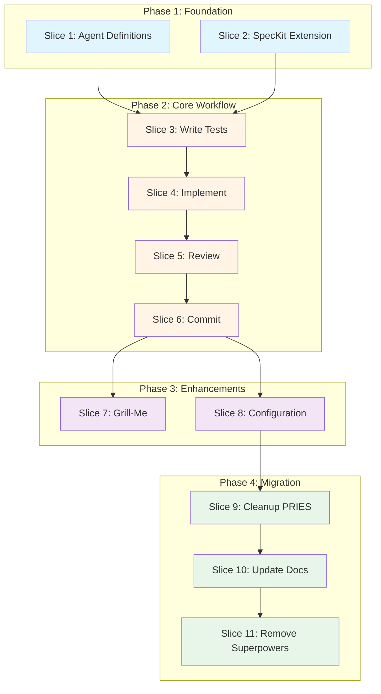

# Roadmap: Multi-Agent TDD Workflow Implementation

**Version:** 1.0  
**Date:** 2026-05-07  
**Status:** Planning  
**Derived From:** PLAN-Multi-Agent-TDD-Implementation.md, TASK-LIST-Multi-Agent-TDD.md

---

## Executive Summary

This roadmap organizes 61 implementation tasks into 11 vertical slices, showing dependencies, parallel execution opportunities, and timeline estimates. The critical path runs through Slices 1 → 3 → 4 → 5 → 6 (TDD workflow core), with supporting slices running in parallel.

**Total Estimated Effort**: 35-42 hours (single developer)  
**Real Duration with Parallelization**: 25-30 hours (2-3 developers)  
**Critical Path Duration**: 18-20 hours

---

## Phase Overview

| Phase | Slices | Effort | Dependencies | Parallelizable |
|-------|--------|--------|--------------|----------------|
| **Phase 1**: Foundation | Slice 1-2 | 7-8 hrs | None | Yes (both slices parallel) |
| **Phase 2**: Core Workflow | Slice 3-6 | 17-20 hrs | Phase 1 | Sequential (3→4→5→6) |
| **Phase 3**: Enhancements | Slice 7-8 | 7-9 hrs | Phase 2 | Yes (both slices parallel) |
| **Phase 4**: Migration | Slice 9-11 | 7-10 hrs | Phase 3 | Sequential (9→10→11) |

---

## Dependency Graph



---

## Phase 1: Foundation (7-8 hours)

**Goal:** Build foundation for multi-agent TDD workflow.

**Slices:** 1-2  
**Parallelization:** Both slices run in parallel  
**Dependencies:** None

### Slice 1: Agent Definitions & Basic Runtime (3-4 hours)

**Tasks (9):**
- S1-001: Create harness-agents plugin manifest (30 min)
- S1-002: Create test-specialist agent (45 min)
- S1-003: Create dev-specialist agent (45 min)
- S1-004: Create arch-specialist agent (45 min)
- S1-005: Create review-specialist agent (45 min)
- S1-006: Create qa-specialist agent (45 min)
- S1-007: Implement /agents.spawn command (2 hrs)
- S1-008: Implement /agents.assign-task command (1.5 hrs)
- S1-009: Test plugin installation (30 min)

**Critical Path:** S1-001 → S1-002/003/004/005/006 (parallel) → S1-007 → S1-008 → S1-009

**Deliverables:**
- Claude Code plugin: harness-agents
- 5 specialist agent definitions
- 2 runtime commands

**Acceptance Criteria:**
- [x] `claude plugin install harness-agents` succeeds
- [ ] All 5 agents spawn correctly
- [ ] Commands available in Claude Code

---

### Slice 2: SpecKit Extension Structure (3-4 hours)

**Tasks (4):**
- S2-001: Create SpecKit extension manifest (45 min)
- S2-002: Create configuration template (1 hr)
- S2-003: Create install hook script (1 hr)
- S2-004: Test extension installation (30 min)

**Critical Path:** S2-001 → S2-002 → S2-003 → S2-004

**Deliverables:**
- SpecKit extension: harness-tdd-workflow
- Configuration template
- Install hook

**Acceptance Criteria:**
- [ ] `specify extension add harness-tdd-workflow` succeeds
- [ ] Config file created at `.specify/harness-tdd-config.yml`
- [ ] Templates copied to `.specify/templates/`

---

**Phase 1 Execution Strategy:**

**Parallel Execution (Recommended):**
- **Developer 1**: Slice 1 (agent definitions, commands)
- **Developer 2**: Slice 2 (SpecKit extension, config)
- **Duration**: 3-4 hours (both slices complete)

**Sequential Execution (Single Developer):**
- Complete Slice 1 first (foundation for agents)
- Then Slice 2 (SpecKit infrastructure)
- **Duration**: 7-8 hours

---

## Phase 2: Core Workflow (17-20 hours)

**Goal:** Implement complete TDD workflow (steps 7-10).

**Slices:** 3-6  
**Parallelization:** None (sequential workflow dependencies)  
**Dependencies:** Phase 1 (both Slice 1 and Slice 2 complete)

### Slice 3: Step 7 - Write Tests (4-5 hours)

**Tasks (6):**
- S3-001: Create test design template (1 hr)
- S3-002: Implement /speckit.multi-agent.test command (2.5 hrs)
- S3-003: Implement file gate validation (1.5 hrs)
- S3-004: Implement failure code detection (2 hrs) — **Longest task in slice**
- S3-005: Implement escalation logic (1 hr)
- S3-006: Test step 7 end-to-end (1 hr)

**Dependencies:**
- S1-002 (test-specialist agent)
- S3-001 (test design template)

**Parallelization within Slice:**
- S3-001 can start immediately
- S3-002, S3-003, S3-004 depend on S3-001
- S3-003 and S3-004 can run in parallel after S3-002
- S3-005 depends on S3-004
- S3-006 waits for all tasks

**Critical Path:** S3-001 → S3-002 → S3-004 → S3-005 → S3-006

**Deliverables:**
- `/speckit.multi-agent.test` command
- Test design artifact template
- File gate enforcement
- Failure code detection

**Acceptance Criteria:**
- [ ] @test agent writes failing tests
- [ ] File gate blocks implementation files
- [ ] Structured failure codes validated

---

### Slice 4: Step 8 - Implement (4-5 hours)

**Tasks (6):**
- S4-001: Create implementation notes template (45 min)
- S4-002: Implement /speckit.multi-agent.implement command (2.5 hrs)
- S4-003: Implement TDD entry validation (2 hrs) — **Longest task in slice**
- S4-004: Implement GREEN state validation (1.5 hrs)
- S4-005: Implement integration validation (1.5 hrs)
- S4-006: Test step 8 end-to-end (1 hr)

**Dependencies:**
- S1-003 (dev-specialist agent)
- S3-006 (step 7 complete, test design artifact exists)

**Parallelization within Slice:**
- S4-001 can start immediately
- S4-002 depends on S4-001
- S4-003, S4-004, S4-005 all depend on S4-002
- S4-004 and S4-005 can run in parallel after S4-003
- S4-006 waits for all tasks

**Critical Path:** S4-001 → S4-002 → S4-003 → S4-004 → S4-006

**Deliverables:**
- `/speckit.multi-agent.implement` command
- Implementation notes template (optional artifact)
- TDD entry validation (RED before GREEN)
- Integration validation

**Acceptance Criteria:**
- [ ] @make agent implements code
- [ ] RED state validated before implementation
- [ ] GREEN state achieved (all tests pass)
- [ ] Integration checks pass

---

### Slice 5: Step 9 - Review (5-6 hours)

**Tasks (7):**
- S5-001: Create arch review template (1 hr)
- S5-002: Create code review template (1 hr)
- S5-003: Implement /speckit.multi-agent.review command (3 hrs) — **Longest task in slice**
- S5-004: Implement conflict resolution logic (2 hrs)
- S5-005: Implement review cycle management (1.5 hrs)
- S5-006: Implement verdict enforcement (1 hr)
- S5-007: Test step 9 end-to-end (1.5 hrs)

**Dependencies:**
- S1-004 (arch-specialist agent)
- S1-005 (review-specialist agent)
- S4-006 (step 8 complete, implementation exists)

**Parallelization within Slice:**
- S5-001 and S5-002 can run in parallel
- S5-003 depends on both S5-001 and S5-002
- S5-004, S5-005, S5-006 all depend on S5-003
- S5-004 and S5-005 can run in parallel
- S5-006 depends on S5-004 (conflict resolution must exist first)
- S5-007 waits for all tasks

**Critical Path:** S5-001/S5-002 → S5-003 → S5-004 → S5-006 → S5-007

**Deliverables:**
- `/speckit.multi-agent.review` command
- Arch review template (mandatory artifact)
- Code review template (mandatory artifact)
- Parallel agent execution
- Conflict resolution
- Review cycle management

**Acceptance Criteria:**
- [ ] @check and @simplify agents run in parallel
- [ ] Conflicts detected and resolved (safety wins)
- [ ] Review cycles tracked (max 3)
- [ ] BLOCKED verdict halts workflow

---

### Slice 6: Step 10 - Commit (3-4 hours)

**Tasks (6):**
- S6-001: Create workflow summary template (1.5 hrs)
- S6-002: Implement /speckit.multi-agent.commit command (2.5 hrs) — **Longest task in slice**
- S6-003: Implement artifact validation (1.5 hrs)
- S6-004: Implement evidence validation (1.5 hrs)
- S6-005: Implement git commit logic (1 hr)
- S6-006: Test step 10 end-to-end (1 hr)

**Dependencies:**
- S5-007 (step 9 complete, reviews exist)

**Parallelization within Slice:**
- S6-001 can start immediately
- S6-002 depends on S6-001
- S6-003 and S6-004 depend on S6-002, can run in parallel
- S6-005 depends on S6-003 and S6-004
- S6-006 waits for all tasks

**Critical Path:** S6-001 → S6-002 → S6-003/S6-004 → S6-005 → S6-006

**Deliverables:**
- `/speckit.multi-agent.commit` command
- Workflow summary template (mandatory artifact)
- Artifact validation
- Evidence validation (RED→GREEN proof)
- Git commit logic

**Acceptance Criteria:**
- [ ] All mandatory artifacts validated
- [ ] Workflow summary created
- [ ] All artifacts committed to feature branch
- [ ] Spec lifecycle updated

---

**Phase 2 Execution Strategy:**

**Sequential Only (Critical Path):**
- Slice 3 must complete before Slice 4 (tests before implementation)
- Slice 4 must complete before Slice 5 (implementation before review)
- Slice 5 must complete before Slice 6 (reviews before commit)
- **Duration**: 17-20 hours (single or multiple developers)

**Optimization Opportunities:**
- Within slices: Parallel tasks noted above
- **Developer 1**: Focus on command implementation (S3-002, S4-002, S5-003, S6-002)
- **Developer 2**: Focus on validation logic (S3-003/004, S4-003/004, S5-004/005, S6-003/004)
- **Duration with 2 devs**: ~12-14 hours (30% time savings)

---

## Phase 3: Enhancements (7-9 hours)

**Goal:** Add interactive planning and configuration customization.

**Slices:** 7-8  
**Parallelization:** Both slices run in parallel  
**Dependencies:** Phase 2 complete (Slice 6)

### Slice 7: Grill-Me Integration (3-4 hours)

**Tasks (4):**
- S7-001: Implement /speckit.multi-agent.plan command (2 hrs)
- S7-002: Implement grill-me skill discovery (1.5 hrs)
- S7-003: Implement interactive Q&A session (1.5 hrs)
- S7-004: Test interactive planning end-to-end (45 min)

**Dependencies:**
- Slice 6 complete (core workflow functional)

**Critical Path:** S7-001 → S7-002 → S7-003 → S7-004

**Deliverables:**
- `/speckit.multi-agent.plan --mode=interactive` command
- Grill-me skill integration (optional dependency)
- Fallback to standard planning

**Acceptance Criteria:**
- [ ] Interactive Q&A runs if grill-me available
- [ ] Graceful degradation if grill-me not found
- [ ] Plan artifact created with decisions documented

---

### Slice 8: Configuration & Customization (3-4 hours)

**Tasks (4):**
- S8-001: Create configuration documentation (2 hrs)
- S8-002: Implement configuration validation (1.5 hrs)
- S8-003: Test artifact customization (1 hr)
- S8-004: Test template override (1 hr)

**Dependencies:**
- Slice 6 complete (core workflow functional)

**Critical Path:** S8-001 → S8-002 → S8-003/S8-004

**Deliverables:**
- Configuration documentation
- JSON Schema validation
- Customization examples

**Acceptance Criteria:**
- [ ] Teams can toggle artifact mandatory flags
- [ ] Teams can customize artifact paths
- [ ] Teams can override templates

---

**Phase 3 Execution Strategy:**

**Parallel Execution (Recommended):**
- **Developer 1**: Slice 7 (grill-me integration)
- **Developer 2**: Slice 8 (configuration documentation)
- **Duration**: 3-4 hours (both slices complete)

**Sequential Execution (Single Developer):**
- Complete Slice 8 first (configuration more foundational)
- Then Slice 7 (grill-me enhancement)
- **Duration**: 7-9 hours

---

## Phase 4: Migration (7-10 hours)

**Goal:** Clean up PRIES plugin, merge phase 5 work, update documentation.

**Slices:** 9-11  
**Parallelization:** None (sequential cleanup dependencies)  
**Dependencies:** Phase 3 (Slice 8)

### Slice 9: Cleanup PRIES & Merge Phase 5 (2-3 hours)

**Tasks (6):**
- S9-001: Archive PRIES plugin (30 min)
- S9-002: Update marketplace README (30 min)
- S9-003: Review phase 5 worktree changes (1 hr)
- S9-004: Merge phase 5 worktree (1.5 hrs)
- S9-005: Close phase 5 worktree (15 min)
- S9-006: Document PRIES deprecation in ADR (45 min)

**Dependencies:**
- Slices 1-8 complete (new workflow must be functional before removing old one)

**Critical Path:** S9-001 → S9-002 → S9-003 → S9-004 → S9-005 → S9-006

**Deliverables:**
- PRIES plugin archived
- Phase 5 worktree merged and closed
- ADR documenting deprecation

**Acceptance Criteria:**
- [ ] PRIES plugin removed from marketplace
- [ ] Phase 5 complete work merged into main
- [ ] Deprecation rationale documented

---

### Slice 10: Update Requirements, Tasks, Roadmap (3-4 hours)

**Tasks (4):**
- S10-001: Update Technical-Requirements.md (2 hrs)
- S10-002: Update Task-List.md (1.5 hrs)
- S10-003: Update Roadmap.md (1.5 hrs)
- S10-004: Cross-reference validation (1 hr)

**Dependencies:**
- S9-006 (PRIES deprecation documented)

**Parallelization within Slice:**
- S10-001, S10-002, S10-003 can run in parallel
- S10-004 waits for all three

**Critical Path:** S10-001/002/003 → S10-004

**Deliverables:**
- Updated requirements (v2.0)
- Updated task list
- Updated roadmap

**Acceptance Criteria:**
- [ ] No PRIES references in docs
- [ ] All requirements trace to dual-plugin architecture
- [ ] All cross-references valid

---

### Slice 11: Remove Superpowers & Update Sandbox Docs (2-3 hours)

**Tasks (5):**
- S11-001: Audit superpowers references (30 min)
- S11-002: Update sandbox CLAUDE.md (1 hr)
- S11-003: Update sandbox README (45 min)
- S11-004: Update sandbox installation guide (30 min)
- S11-005: Final documentation review (1 hr)

**Dependencies:**
- S10-004 (requirements docs updated)

**Critical Path:** S11-001 → S11-002 → S11-003/S11-004 → S11-005

**Deliverables:**
- Updated sandbox documentation
- Superpowers removed from docs

**Acceptance Criteria:**
- [ ] No superpowers references in harness-sandbox docs
- [ ] Dual-plugin architecture documented
- [ ] Installation guide updated

---

**Phase 4 Execution Strategy:**

**Sequential Only:**
- Slice 9 must complete before Slice 10 (PRIES removal before doc updates)
- Slice 10 must complete before Slice 11 (requirements before sandbox docs)
- **Duration**: 7-10 hours (single or multiple developers)

**Optimization Opportunities:**
- Within Slice 10: Parallel doc updates (S10-001/002/003)
- **Developer 1**: S10-001 (requirements)
- **Developer 2**: S10-002, S10-003 (task list, roadmap)
- **Duration with 2 devs**: ~6-8 hours (20% time savings)

---

## Critical Path Analysis

**Longest Sequential Chain:**

```
Phase 1: Slice 1 OR Slice 2 (parallel, 3-4 hrs each)
  ↓
Phase 2: Slice 3 → Slice 4 → Slice 5 → Slice 6 (17-20 hrs sequential)
  ↓
Phase 3: Slice 7 OR Slice 8 (parallel, 3-4 hrs each)
  ↓
Phase 4: Slice 9 → Slice 10 → Slice 11 (7-10 hrs sequential)
```

**Critical Path Duration:** ~28-34 hours (single developer, no parallelization within slices)

**Optimized Duration (2-3 developers):**
- Phase 1: 3-4 hrs (parallel)
- Phase 2: 12-14 hrs (parallel within slices)
- Phase 3: 3-4 hrs (parallel)
- Phase 4: 6-8 hrs (parallel within Slice 10)
- **Total**: ~25-30 hours

---

## Execution Strategies

### Strategy 1: Single Developer, Sequential (Conservative)

**Duration:** 35-42 hours (5-6 working days)

**Approach:**
- Complete all tasks in order (Slice 1 → Slice 2 → ... → Slice 11)
- No parallelization
- Thorough testing after each slice

**Pros:**
- Lower risk (one thing at a time)
- Easier to debug (clear causal chain)
- No coordination overhead

**Cons:**
- Longest duration
- No time savings from parallelization

**Best For:** Solo developer, learning new codebase, high-quality standards

---

### Strategy 2: Dual Developers, Parallel (Aggressive)

**Duration:** 25-30 hours (3-4 working days)

**Approach:**
- **Developer 1 (Critical Path):**
  - Phase 1: Slice 1 (agent definitions)
  - Phase 2: Command implementations (S3-002, S4-002, S5-003, S6-002)
  - Phase 3: Slice 7 (grill-me)
  - Phase 4: Slice 9, S10-001 (cleanup, requirements)

- **Developer 2 (Support Track):**
  - Phase 1: Slice 2 (SpecKit extension)
  - Phase 2: Validation logic (S3-003/004, S4-003/004, S5-004/005, S6-003/004)
  - Phase 3: Slice 8 (configuration)
  - Phase 4: S10-002/003, Slice 11 (task list, roadmap, sandbox docs)

**Pros:**
- Fastest completion time
- Efficient resource utilization
- Parallel testing coverage

**Cons:**
- Requires coordination
- Integration risk (both devs must sync)
- More complex debugging

**Best For:** Team with good communication, time-constrained project

---

### Strategy 3: Hybrid (Recommended)

**Duration:** 30-35 hours (4-5 working days)

**Approach:**
- **Phase 1-2 (Single Developer):**
  - Complete foundation and core workflow sequentially (20-24 hrs)
  - Ensure solid base before expanding team

- **Phase 3 (Parallel, 2 Developers):**
  - Developer 1: Slice 7
  - Developer 2: Slice 8
  - (3-4 hrs)

- **Phase 4 (Single Developer):**
  - Complete cleanup and documentation sequentially (7-10 hrs)
  - Ensure consistency in migration

**Pros:**
- Balances speed and quality
- Reduces coordination overhead
- Parallelizes low-risk enhancements only

**Cons:**
- Longer than full parallel
- Still requires some coordination

**Best For:** Most teams, balances time and risk

---

## Milestones & Deliverables

### Milestone 1: Foundation Complete (After Phase 1)
**Deliverables:**
- harness-agents Claude Code plugin installed
- harness-tdd-workflow SpecKit extension installed
- All 5 specialist agents available
- Configuration template in place

**Acceptance:**
- [ ] Both plugins install without errors
- [ ] `/agents.spawn test-specialist` works
- [ ] `/agents.assign-task` works

---

### Milestone 2: Core Workflow Complete (After Phase 2)
**Deliverables:**
- `/speckit.multi-agent.test` command functional
- `/speckit.multi-agent.implement` command functional
- `/speckit.multi-agent.review` command functional
- `/speckit.multi-agent.commit` command functional
- All 5 artifact templates created

**Acceptance:**
- [ ] Full workflow executes end-to-end
- [ ] All quality gates enforce (TDD, evidence, review)
- [ ] All 5 artifacts created correctly

---

### Milestone 3: Enhancements Complete (After Phase 3)
**Deliverables:**
- `/speckit.multi-agent.plan --mode=interactive` functional
- Configuration documentation complete
- Teams can customize artifacts

**Acceptance:**
- [ ] Grill-me integration works (if available)
- [ ] Configuration validation works
- [ ] Teams can toggle artifact behavior

---

### Milestone 4: Migration Complete (After Phase 4)
**Deliverables:**
- PRIES plugin removed
- Phase 5 worktree merged
- All documentation updated
- Superpowers removed from docs

**Acceptance:**
- [ ] No PRIES references in codebase
- [ ] No superpowers references in docs
- [ ] All cross-references valid

---

## Risk Management

### High-Risk Areas

| Risk | Phase | Mitigation |
|------|-------|------------|
| SpecKit API compatibility | Phase 2 | Prototype Slice 5 early, fall back to sequential reviews if needed |
| Parallel agent coordination | Phase 2, Slice 5 | Clear conflict resolution rules, test with real examples |
| Test output parsing | Phase 2, Slice 3 | Configurable regex patterns, framework-specific parsers |
| Phase 5 merge conflicts | Phase 4, Slice 9 | Careful audit first (S9-003), resolve conflicts incrementally |

### Medium-Risk Areas

| Risk | Phase | Mitigation |
|------|-------|------------|
| Grill-me unavailability | Phase 3, Slice 7 | Graceful degradation to standard planning |
| Template customization errors | Phase 3, Slice 8 | Template validation on load, clear error messages |
| Documentation cross-references | Phase 4, Slice 10 | Automated cross-reference validation (S10-004) |

---

## Success Criteria

Implementation is successful when:

1. **All 61 tasks complete:**
   - [ ] Phase 1: 13/13 tasks (Slices 1-2)
   - [ ] Phase 2: 25/25 tasks (Slices 3-6)
   - [ ] Phase 3: 8/8 tasks (Slices 7-8)
   - [ ] Phase 4: 15/15 tasks (Slices 9-11)

2. **All 4 milestones achieved:**
   - [ ] Milestone 1: Foundation
   - [ ] Milestone 2: Core Workflow
   - [ ] Milestone 3: Enhancements
   - [ ] Milestone 4: Migration

3. **Full workflow functional:**
   - [ ] `/speckit.multi-agent.test` → `/speckit.multi-agent.implement` → `/speckit.multi-agent.review` → `/speckit.multi-agent.commit` executes end-to-end
   - [ ] All 5 artifacts created correctly
   - [ ] Quality gates enforce (TDD, evidence, review)

4. **Configuration works:**
   - [ ] Teams can toggle artifact mandatory flags
   - [ ] Teams can customize artifact paths
   - [ ] Teams can override templates

5. **Clean migration:**
   - [ ] PRIES plugin removed
   - [ ] Phase 5 worktree merged
   - [ ] Documentation updated (no PRIES, no superpowers)
   - [ ] All cross-references valid

---

## Timeline Estimates

### Conservative Timeline (Single Developer, Sequential)
- **Week 1**: Phase 1-2 (foundation + core workflow, 24-28 hrs)
- **Week 2**: Phase 3-4 (enhancements + migration, 14-19 hrs)
- **Total**: 2 weeks (38-47 hours including buffer)

### Aggressive Timeline (Dual Developers, Parallel)
- **Week 1**: Phase 1-3 (foundation + core + enhancements, 23-28 hrs)
- **Week 2**: Phase 4 (migration, 7-10 hrs)
- **Total**: 1.5 weeks (30-38 hours including buffer)

### Recommended Timeline (Hybrid Approach)
- **Week 1**: Phase 1-2 (foundation + core, 24-28 hrs)
- **Week 2**: Phase 3-4 (enhancements + migration, 14-19 hrs)
- **Total**: 2 weeks (38-47 hours including buffer)

---

## Progress Tracking

**Phase Completion:**
- [ ] **Phase 1**: Foundation (0/13 tasks)
- [ ] **Phase 2**: Core Workflow (0/25 tasks)
- [ ] **Phase 3**: Enhancements (0/8 tasks)
- [ ] **Phase 4**: Migration (0/15 tasks)

**Milestone Completion:**
- [ ] **Milestone 1**: Foundation Complete
- [ ] **Milestone 2**: Core Workflow Complete
- [ ] **Milestone 3**: Enhancements Complete
- [ ] **Milestone 4**: Migration Complete

**Overall Progress**: 0/61 tasks (0%)

---

## Next Steps

1. **Review Roadmap with Team:**
   - Validate dependencies (critical path correct?)
   - Confirm execution strategy (single, dual, or hybrid?)
   - Approve timeline (1.5 weeks vs 2 weeks?)

2. **Select Execution Strategy:**
   - Assign developers to tracks (if parallel)
   - Set up coordination meetings (if dual devs)
   - Agree on testing checkpoints

3. **Execute Phase 1:**
   - Start Slice 1 and Slice 2 (parallel if dual devs)
   - Daily standup to sync progress
   - Achieve Milestone 1 by end of day 1-2

4. **Monitor Critical Path:**
   - Track Phase 2 progress daily (longest phase)
   - Alert if Slice 5 parallel agents hit blockers
   - Test Milestone 2 thoroughly before Phase 3

---

## Related Documents

- [PLAN-Multi-Agent-TDD-Implementation.md](PLAN-Multi-Agent-TDD-Implementation.md) — Implementation plan (vertical slices)
- [TASK-LIST-Multi-Agent-TDD.md](TASK-LIST-Multi-Agent-TDD.md) — Granular task breakdown
- [PRD-Multi-Agent-TDD-Workflow.md](../harness-tooling/docs/PRD-Multi-Agent-TDD-Workflow.md) — Product requirements
- [CONSTITUTION-Multi-Agent-TDD.md](CONSTITUTION-Multi-Agent-TDD.md) — Constitutional principles
- [ARTIFACT-SUMMARY.md](ARTIFACT-SUMMARY.md) — Artifact details and configuration
