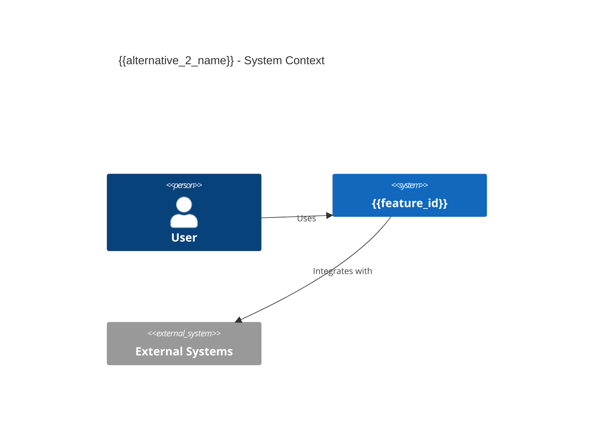
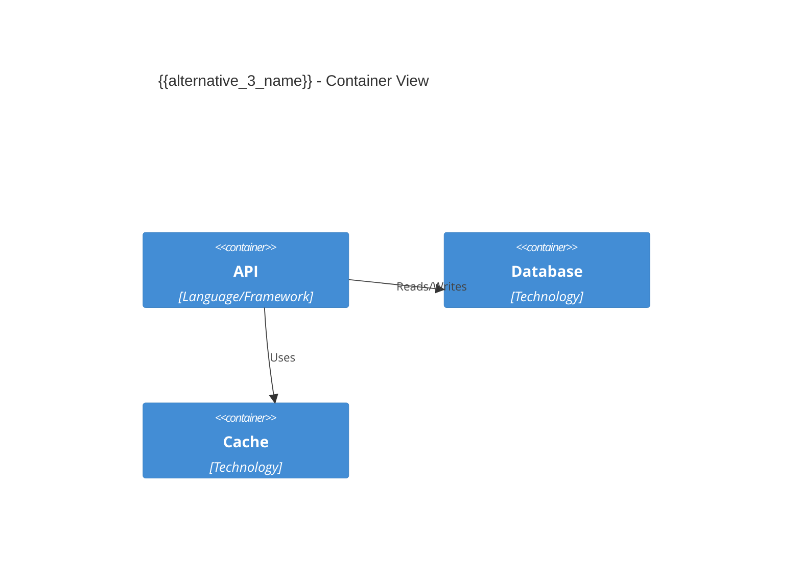

# Architecture Decision Record: {{title}}

**Feature ID:** {{feature_id}}  
**Status:** {{status}}  
**Decision Date:** {{date}}

## Context & Problem Statement

_Provide a brief background on the architectural problem or decision point. Explain what drove the need for this architectural decision and any constraints or requirements that shaped it._

**Key Context:**
- Summarize the business or technical drivers
- Outline any constraints (performance, cost, complexity, maintainability)
- Reference related decisions or prior art (if applicable)

## Decision Criteria

_Fixed set of criteria used to evaluate alternatives. Extend if user requests additional criteria._

| Criterion | Definition | Weight |
|-----------|-----------|--------|
| Performance | Ability to meet latency, throughput, and scalability requirements | High |
| Maintainability | Ease of understanding, modifying, and extending the solution | High |
| Cost | Infrastructure, operational, and development costs | Medium |
| Complexity | Implementation complexity and cognitive overhead | High |

## Solution Alternative 1: {{alternative_1_name}}

### Description

_Detailed explanation of this architectural approach:_
- How it works at a high level
- Key components or patterns used
- Technology choices involved

### C1 Context Diagram

### C2 Container Diagram

### Pros / Cons

**Pros:**
- _Positive aspect 1_
- _Positive aspect 2_
- _Positive aspect 3_

**Cons:**
- _Negative aspect 1_
- _Negative aspect 2_
- _Negative aspect 3_

## Solution Alternative 2: {{alternative_2_name}}

### Description

_Detailed explanation of this architectural approach:_
- How it works at a high level
- Key components or patterns used
- Technology choices involved

### C1 Context Diagram

### C2 Container Diagram

### Pros / Cons

**Pros:**
- _Positive aspect 1_
- _Positive aspect 2_
- _Positive aspect 3_

**Cons:**
- _Negative aspect 1_
- _Negative aspect 2_
- _Negative aspect 3_

## Solution Alternative 3: {{alternative_3_name}}

### Description

_Detailed explanation of this architectural approach:_
- How it works at a high level
- Key components or patterns used
- Technology choices involved

### C1 Context Diagram

### C2 Container Diagram

### Pros / Cons

**Pros:**
- _Positive aspect 1_
- _Positive aspect 2_
- _Positive aspect 3_

**Cons:**
- _Negative aspect 1_
- _Negative aspect 2_
- _Negative aspect 3_

## Recommendation

_Agent recommends Alternative N for the following reasons:_

**Rationale:**
- _Why this alternative best satisfies the decision criteria_
- _Trade-off analysis relative to other alternatives_
- _Risk mitigation for known concerns_

**Note:** Agent makes the recommendation; the user confirms and decides.

## Decision

_The chosen alternative will be documented here after review and user decision:_

**Chosen:** {{chosen_alternative}}

**Decision Maker:** _Name/Role_

**Date:** _Decision date_

## Consequences

_Positive and negative consequences of this decision:_

### Benefits Realized
- _Positive outcome 1_
- _Positive outcome 2_

### New Constraints
- _Constraint or limitation introduced_
- _Ongoing maintenance consideration_

### Future Work
- _Follow-up decisions or architectural work required_
- _Monitoring or evaluation criteria_

---

**Verification Checklist:**
- [ ] All three alternatives documented with C1/C2 diagrams
- [ ] Decision criteria clearly defined
- [ ] Pros and cons balanced for each alternative
- [ ] Recommendation provided with clear rationale
- [ ] Decision made and documented
- [ ] Consequences understood and accepted
