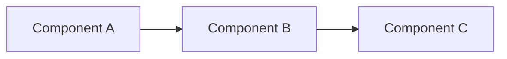

# Architecture Review: {{feature_name}}

**Feature ID:** {{feature_id}}  
**Reviewer:** @arch  
**Status:** {{status}}  
**Created:** {{timestamp}}

## Review Scope

_What aspects of the implementation are being reviewed:_
- [ ] Alignment with system architecture
- [ ] Design pattern usage
- [ ] Component boundaries
- [ ] Data flow
- [ ] Performance implications
- [ ] Security considerations

## Architecture Assessment

### Design Alignment
_Does the implementation follow established architectural patterns?_

**Verdict:** `[APPROVED | CONCERNS | BLOCKED]`

**Details:**
- Architectural style: _e.g., layered, hexagonal, microservices_
- Pattern adherence: _e.g., follows repository pattern, uses dependency injection_
- Deviations: _any departures from established patterns_

### Component Design
_Evaluate component boundaries and responsibilities:_

**Components Modified/Created:**
- `ComponentName1` - _responsibility and evaluation_
- `ComponentName2` - _responsibility and evaluation_

**Cohesion & Coupling:**
- Cohesion level: `[HIGH | MEDIUM | LOW]`
- Coupling level: `[LOOSE | MODERATE | TIGHT]`
- Concerns: _if any_

### Data Flow & Dependencies
_Evaluate how data moves through the system:_

**Data Flow Diagram:** _(optional, Mermaid syntax)_

**Dependencies:**
- New dependencies introduced: _list_
- Dependency justification: _why needed_
- Potential circular dependencies: _none | list_

## Findings

### Strengths
_What was done well:_
- ✓ _Positive finding 1_
- ✓ _Positive finding 2_

### Concerns
_Issues that should be addressed but don't block merge:_

| ID | Concern | Severity | Recommendation |
|----|---------|----------|----------------|
| C1 | _description_ | Low/Medium | _suggestion_ |

### Blockers
_Critical issues that must be fixed before merge:_

| ID | Blocker | Impact | Required Action |
|----|---------|--------|-----------------|
| B1 | _description_ | High | _must do_ |

## Recommendations

_Suggested improvements (optional, can be future work):_
- [ ] _Recommendation 1_ (priority: low/medium/high)
- [ ] _Recommendation 2_ (priority: low/medium/high)

## Review Cycle

**Cycle:** {{cycle_number}} / {{max_cycles}}

**Previous Findings:** _(if cycle > 1)_
- _List findings from previous cycle_

**Convergence Check:** _(if enabled)_
- New findings same as previous? `[YES | NO]`
- Action: `[CONTINUE | ESCALATE_DEADLOCK]`

## Decision

**Verdict:** `[APPROVED | REQUEST_CHANGES | BLOCKED]`

**Justification:**
_Explain the verdict and next steps_

**Route:** `[proceed_to_code_review | return_to_implementation | escalate]`

---

**Verification Checklist:**
- [ ] All architectural concerns documented
- [ ] Blockers clearly identified
- [ ] Recommendations prioritized
- [ ] Verdict justified
- [ ] Next steps clear
