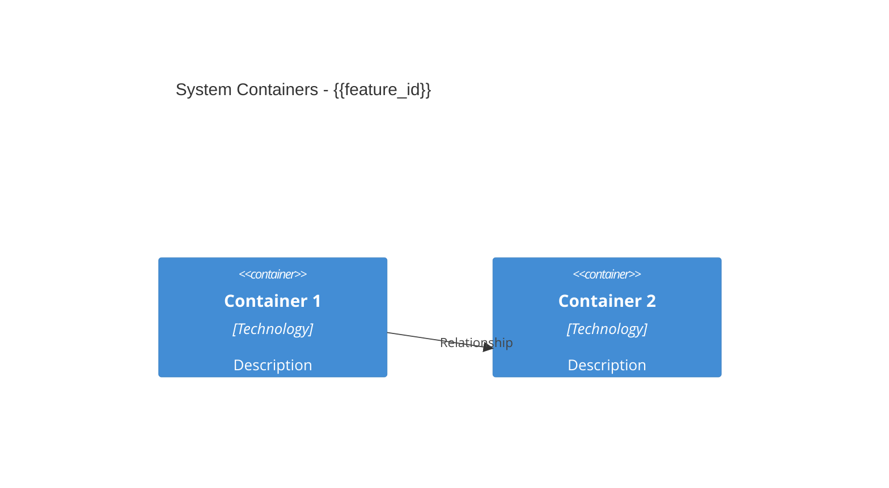
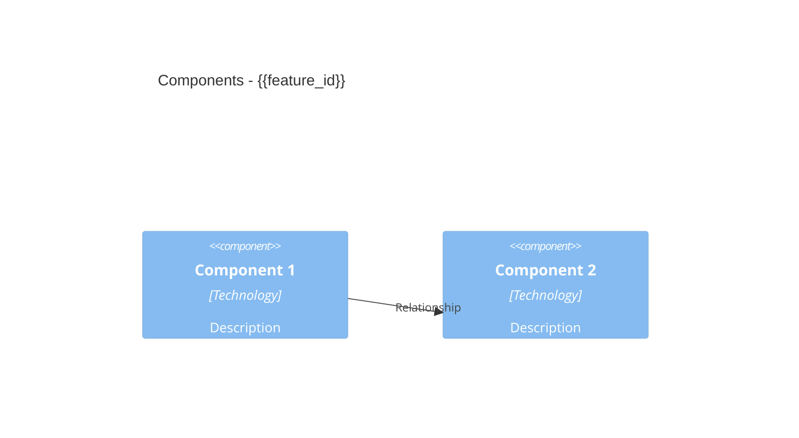
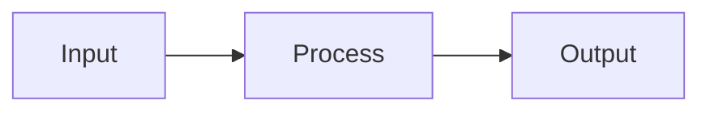
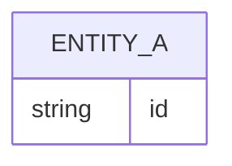

# Solution Design: {{feature_id}}

**Feature ID:** {{feature_id}}  
**Status:** {{status}}  
**Created:** {{timestamp}}  
**ADR Reference:** {{feature_id}}-adr.md

## Decomposition View

_Decompose the system into logical containers and components. Use C4 Context/Container/Component diagrams to visualize the structural hierarchy and boundaries of your solution._

### C2 Container Diagram

### C3 Component Diagram

## Dependency View

_Map out the dependencies between system components, both internal and external. Analyze coupling to identify tight dependencies and integration points._

### Internal Dependencies

_List intra-system dependencies (component-to-component relationships). Document the direction of dependency (A depends on B) and type (inheritance, composition, message passing, etc.)._

### External Dependencies

_Document external system dependencies, third-party libraries, APIs, and platform services. Include version constraints and integration patterns._

### Coupling Analysis

_Analyze the coupling characteristics: tight vs. loose, synchronous vs. asynchronous. Identify potential refactoring opportunities to reduce coupling._

## Interface View

_Define the boundary contracts between your system and external consumers, as well as internal subsystem interfaces. Include API signatures, event schemas, and protocol definitions._

### External API Contracts

_Document REST, gRPC, event-driven, or other external interface contracts. Include request/response schemas, error handling, and versioning strategy._

### Internal Interface Definitions

_Document public interfaces between internal components. Specify module boundaries, exported functions, or service contracts that other components depend on._

### Event Schemas

_(If applicable)_ _Document event structures for event-driven interactions. Include event names, payload schemas, and event flow diagrams._

## Data Design View

_Specify how data flows through the system, data structures, and persistence strategies. Include entity-relationship models and key schemas._

### Data Flow Diagram

### Entity-Relationship Diagram

### Key Schemas

_Document primary data structures, database schemas, cache structures, or message payloads. Include relationships between entities and any constraints._

---

**Verification Checklist:**
- [ ] All four views present: Decomposition, Dependency, Interface, Data Design
- [ ] C4Container diagram in Decomposition View
- [ ] C4Component diagram in Decomposition View
- [ ] Data Flow Diagram in Data Design View
- [ ] Entity-Relationship Diagram in Data Design View
- [ ] All internal dependencies documented
- [ ] All external dependencies documented
- [ ] Coupling analysis complete
- [ ] External API contracts defined
- [ ] Internal interface definitions documented
- [ ] Event schemas defined (if applicable)
- [ ] All template variables replaced
